# Urban Scape
### PLATEAU-SDK-Toolkits-for-Unityを使ったサンプルプロジェクト
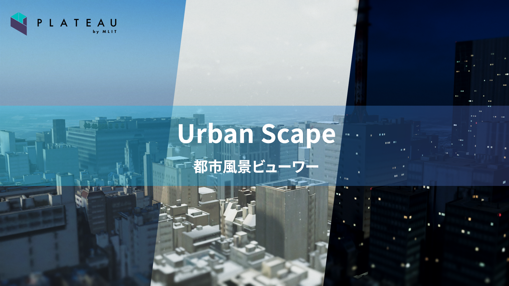


### 更新履歴

| 更新日時 | 更新内容 |
| :--- | :--- |
|  2023/12/25  |  UrbanScape　初回リリース|

# 目次
<!-- @import "[TOC]" {cmd="toc" depthFrom=1 depthTo=2 orderedList=false} -->

<!-- code_chunk_output -->

- [Urban Scape](#urban-scape)
- [目次](#目次)
- [1. サンプルプロジェクトの概要](#1-サンプルプロジェクトの概要)
  - [1-1. サンプルプロジェクトで体験できること](#1-1-サンプルプロジェクトで体験できること)
  - [1-2. Unityプロジェクト情報](#1-2-unityプロジェクト情報)
  - [1-3. 利用している PLATEAU SDK-Toolkits の機能](#1-3-利用している-plateau-sdk-toolkits-の機能)
- [2. 利用手順](#2-利用手順)
  - [2-1. 推奨環境](#2-1-推奨環境)
  - [2-2. サンプルプロジェクトのビルド方法](#2-2-サンプルプロジェクトのビルド方法)
  - [2-3. ビルドしたアプリケーションの操作方法](#2-3-ビルドしたアプリケーションの操作方法)
- [3. サンプルプロジェクトのカスタマイズ方法](#3-サンプルプロジェクトのカスタマイズ方法)
  - [3-1. 3D都市モデルの変更](#3-1-3d都市モデルの変更)
- [4. 3D都市モデルを使った都市景観作成時のTips](#4-3d都市モデルを使った都市景観作成時のtips)
  - [4-1. サンプル都市モデルの作成](#4-1-サンプル都市モデルの作成)
  - [4-2. 道路や地面の調整のTips](#4-2-道路や地面の調整のtips)
  - [4-3. プロップ/アバター/乗り物の配置](#4-3-プロップアバター乗り物の配置)
  - [4-4. ポストエフェクトの適用(HDRP)](#4-4-ポストエフェクトの適用hdrp)

<!-- /code_chunk_output -->
 
# 1. サンプルプロジェクトの概要
## 1-1. サンプルプロジェクトで体験できること
- 本サンプルプロジェクトを使うことで、都市の景観を綺麗に見せられるようなビューアーアプリを作ることが可能です。
- 都市でのPV作成などのユースケースを想定したサンプルプロジェクトです。

## 1-2. Unityプロジェクト情報

### Unity バージョン
- Unity 2021.3.30f1

### レンダリングパイプライン
- HDRP (HighDefinition Rendering Pipeline)
- URP (Universal Rendering Pipeline)

Built-in Rendering Pipelineでは動作しません。

## 1-3. 利用している PLATEAU SDK-Toolkits の機能

### Rendering Toolkit (PLATEAU SDK-Toolkits)
- 天候の変更
- 時間変更
- ポストエフェクト

### Sandbox Toolkit (PLATEAU SDK-Toolkits)
- 人の配置
- 車の配置
- プロップの配置

### PLATEAU SDK-Maps-Toolkit
- Cesium for Unity を使ったPLATEAUモデルの位置合わせ

# 2. 利用手順
## 2-1. 推奨環境
### 参考開発環境
以下は本プロジェクトで使用した開発環境です。

- Windows 11
- macOS Ventura 13.2

## 2-2. サンプルプロジェクトのビルド方法

1. "Assets/Scenes/UrbanScape" を開きます。


2. 最初にHDRPに関してのウィザードが表示されることがありますが、閉じてください。
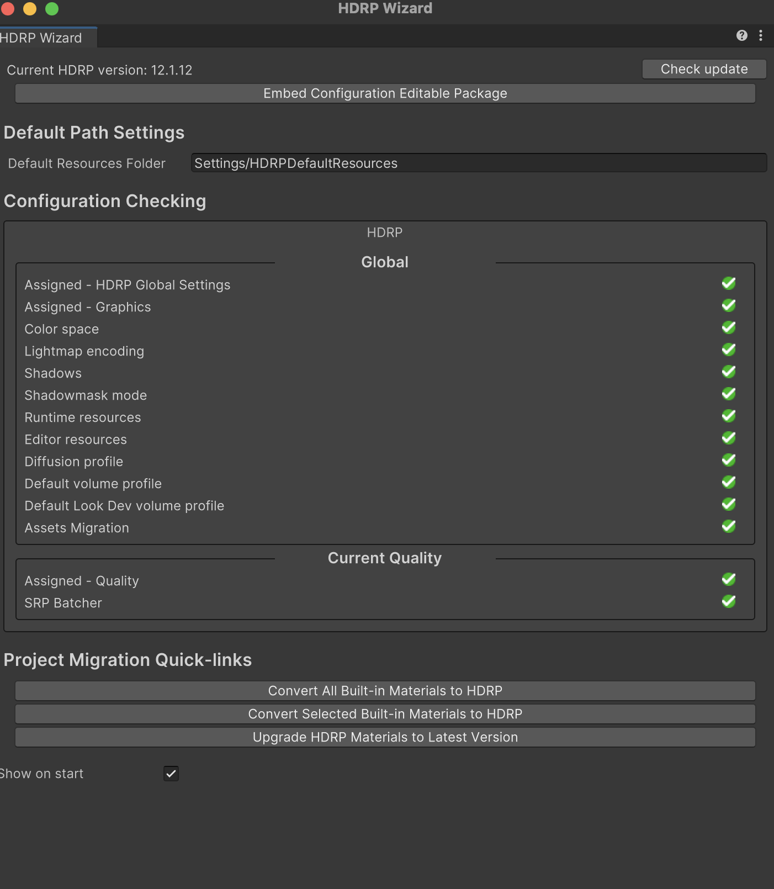

3. メニューより "File" > "Build Settings" を選択します。
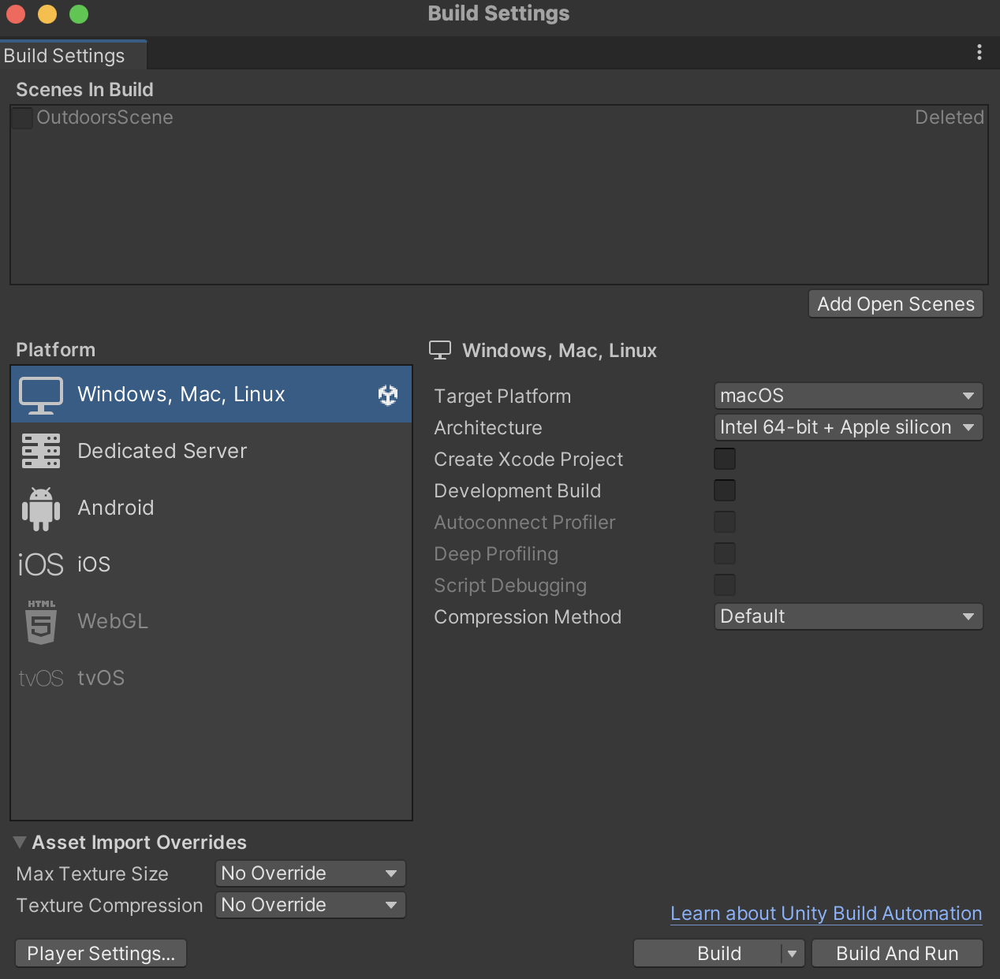

4. 画面下部にある「Build」ボタンを押下します。出力先を選択してビルドを開始します。

## 2-3. ビルドしたアプリケーションの操作方法

1. ビルドしたアプリケーションを開くと、オープニング画面が表示されます。<br>「始めましょう」ボタンを押下してください。<br>
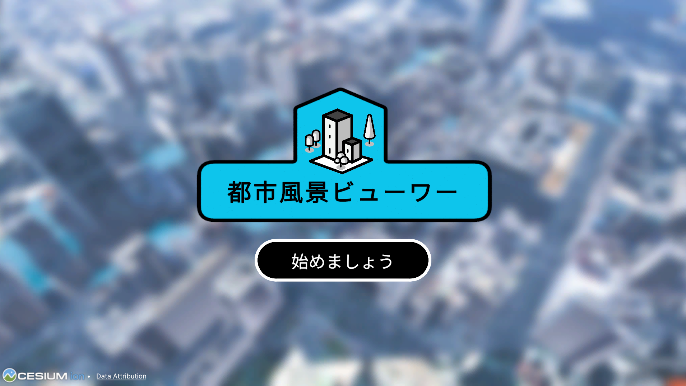

2. ホームビューに遷移します。このビューではマウス操作によってカメラを回転させることができます。<br>
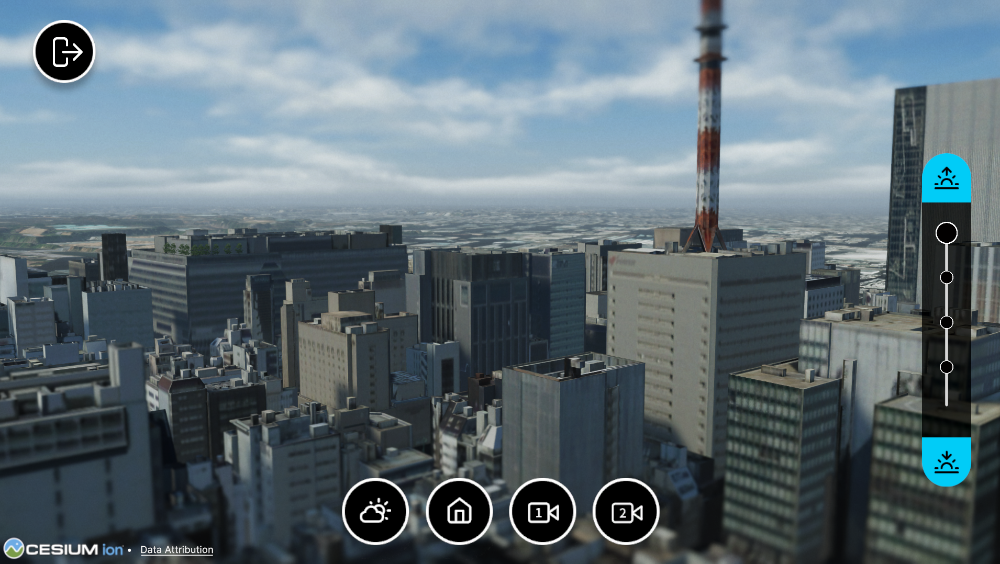<br>
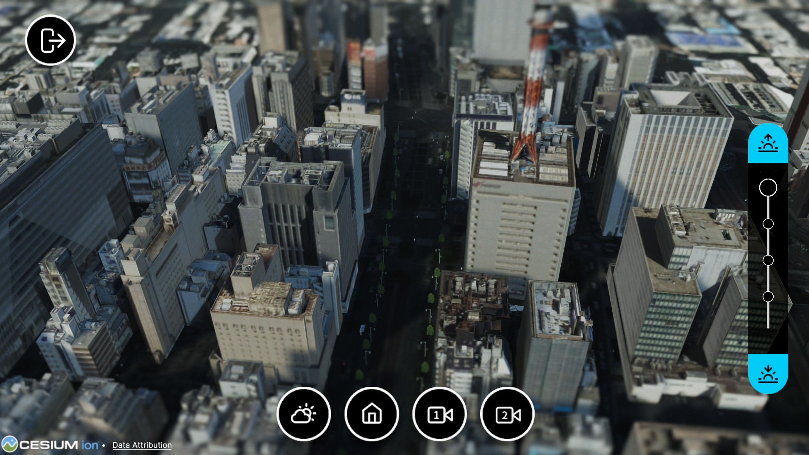
<br><br>

3. 画面右の時間帯変更スライダーを調整すると、シーンの時間帯を変更することができます。<br>
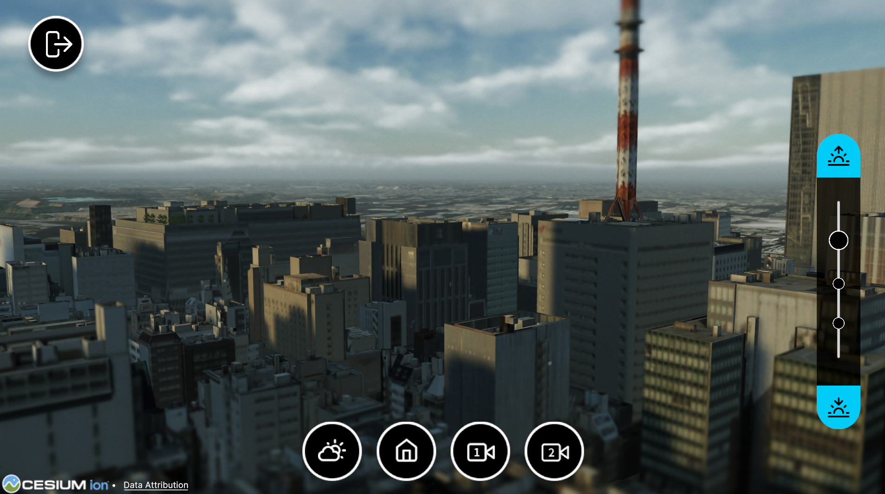<br>
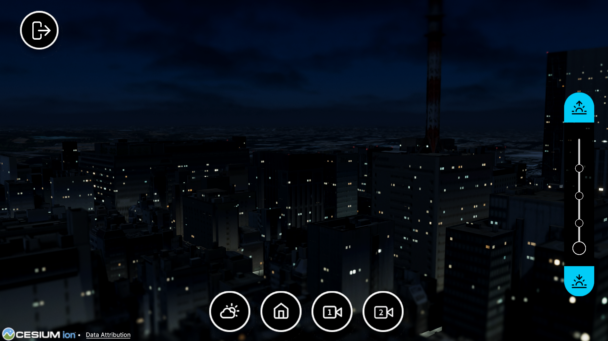

4. 天候ボタンを押下すると、各天候を調整するためのスライダーが表示されます。スライダーを動かすことで天候の変化が可能です。<br>
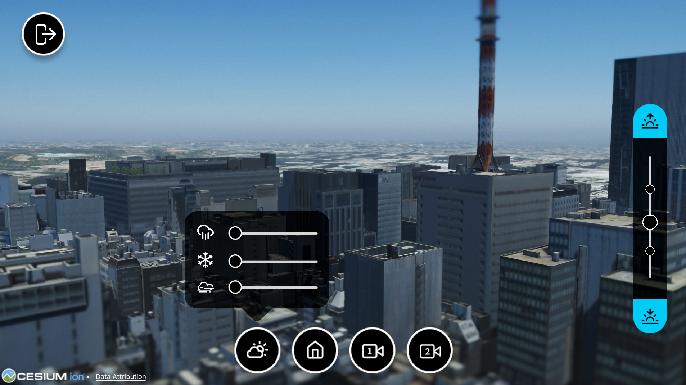<br>
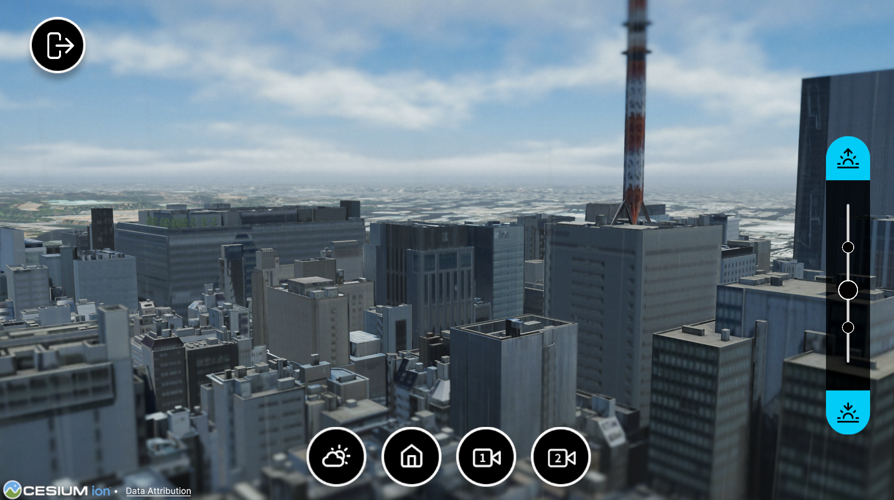<br>
<br>
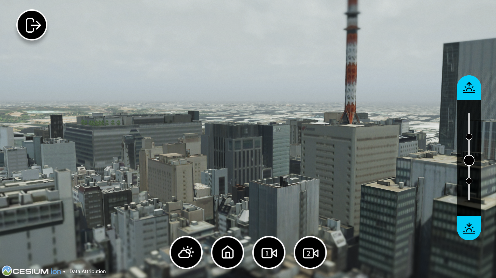

5. 固定カメラ１ボタンを押下すると、人や車の通行が確認できる定点カメラビューに遷移します。<br>
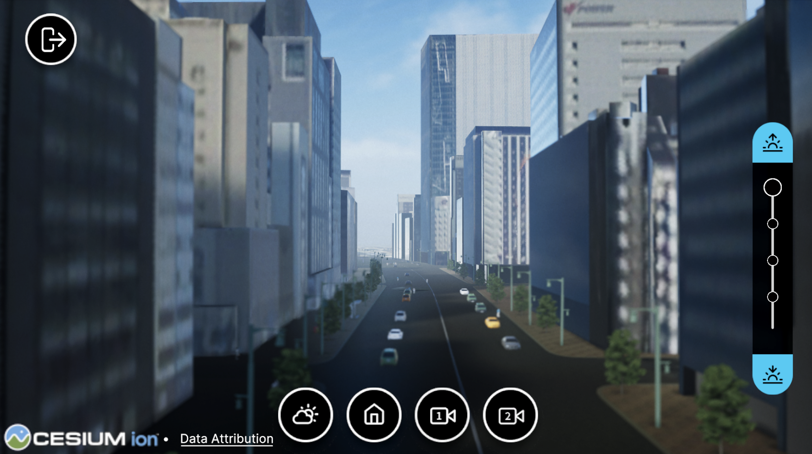

6. 固定カメラ２ボタンを押下すると、俯瞰視点の定点カメラビューに遷移します。このカメラには「トイカメラ」のポストエフェクトが適用されています。<br>
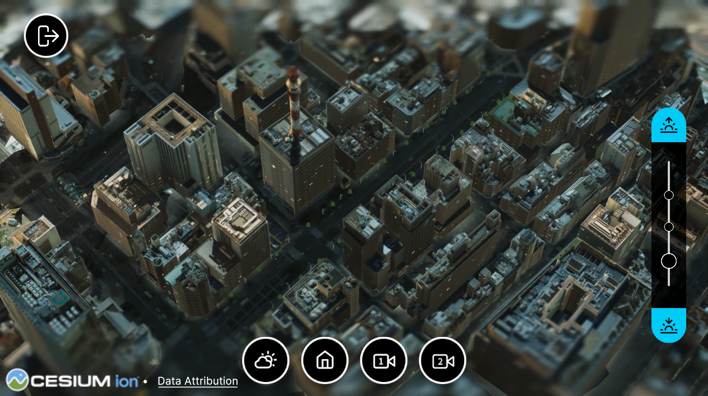

7. ホームボタンを押すと、ホームビューに戻ります。<br>

<br>

8. 歩いているアバターや走っている乗り物をクリックすると、カメラインタラクションモードに入ります。左に表示される数字ボタンを押すと視点を切り替えることができます。<br>

「1」ボタンを押下すると一人称視点モードに変わります。<br>


「2」ボタンを押下すると三人称視点モードに変わります。<br>
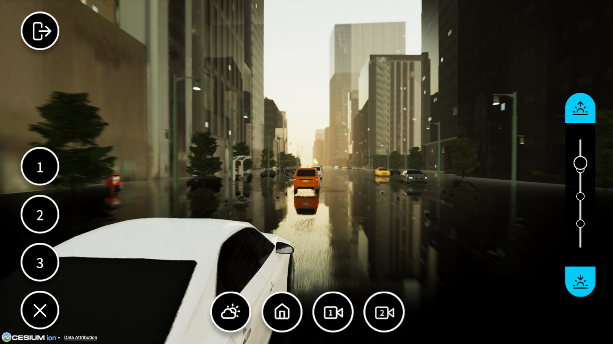

「3」ボタンを押下すると見回しモードに変わります。<br>
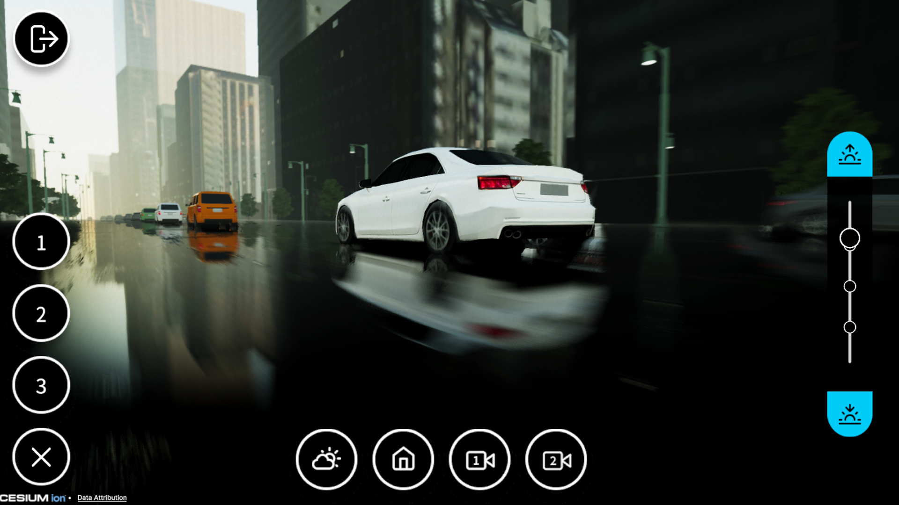

詳しくは Sandbox Toolkit の[カメラインタラクションについて](https://github.com/unity-shimizu/PLATEAU-SDK-Toolkits-for-Unity/blob/main/PlateauToolkit.Sandbox/README.md#3-%E3%82%AB%E3%83%A1%E3%83%A9%E3%82%A4%E3%83%B3%E3%82%BF%E3%83%A9%E3%82%AF%E3%82%B7%E3%83%A7%E3%83%B3%E6%A9%9F%E8%83%BD)をご確認ください。

# 3. サンプルプロジェクトのカスタマイズ方法
## 3-1. 3D都市モデルの変更

シーンをカスタマイズし、3D都市モデルや配置物を変更したい場合は "Assets/Simulation.unity" をひらき、シーンを編集します。

<br>

3D都市モデルを変更する場合はヒエラルキーの中の "CesiumGeoreference" の中にある3D都市モデルを削除した上で、別途インポートした3D都市モデルを同じ場所に配置してください。

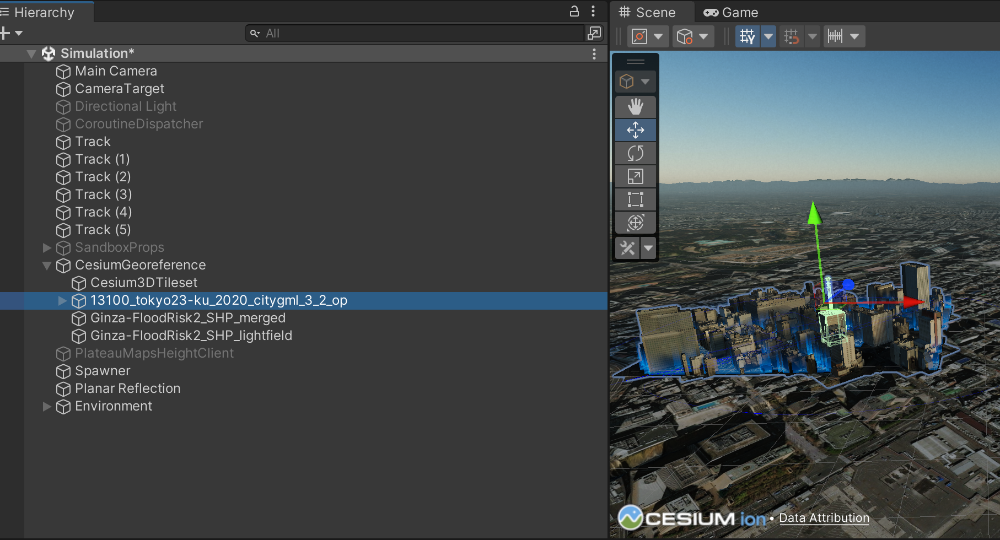

> **Note**
> 3D都市モデルのインポートはPLATEAU SDK for Unityを利用して行ってください。
> （[都市モデルのインポート](https://project-plateau.github.io/PLATEAU-SDK-for-Unity/manual/ImportCityModels.html)）
> 本サンプルで使われている3D都市モデル位置合わせ機能はMaps Toolkitの機能です。（[PLATEAUモデル位置合わせ - Maps Toolkit](https://github.com/Project-PLATEAU/PLATEAU-SDK-Toolkits-for-Unity/blob/main/maps_toolkit.md#1-plateau%E3%83%A2%E3%83%87%E3%83%AB%E4%BD%8D%E7%BD%AE%E5%90%88%E3%82%8F%E3%81%9B)）

# 4. 3D都市モデルを使った都市景観作成時のTips
3D都市モデルを使って都市景観を作成する際には、利用するデバイスに応じてモデルを最適化することが重要です。
また、テクスチャを差し替えたり、現実の都市空間にあるものをプロップスとして配置したりするなどの工夫で外観のクオリティを高めることができます。
本セクションでは、このサンプルシーンを構築する際に行った景観クオリティ向上のための手順をご紹介します。

## 4-1. サンプル都市モデルの作成

### PLATEAU SDKでの都市モデルの読み込み
PLATEAU SDKを使用して都市モデルを読み込みます。
サンプルでは、建築物モデルLOD2、地形モデルLOD1、道路モデルLOD1を配置しました。
地形モデルに対しては、PLATEAU SDKの機能を用いて空中写真を張り付けています。

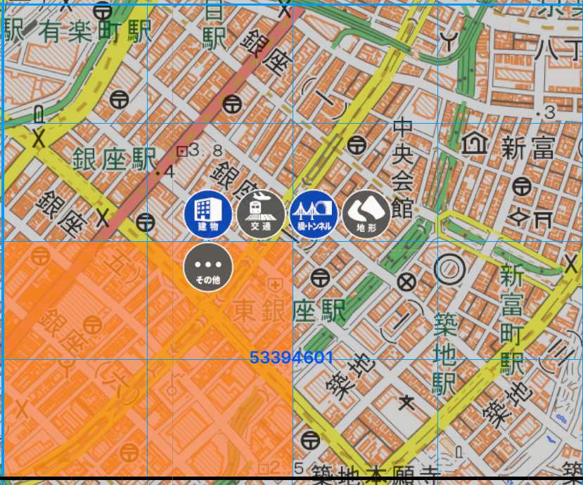

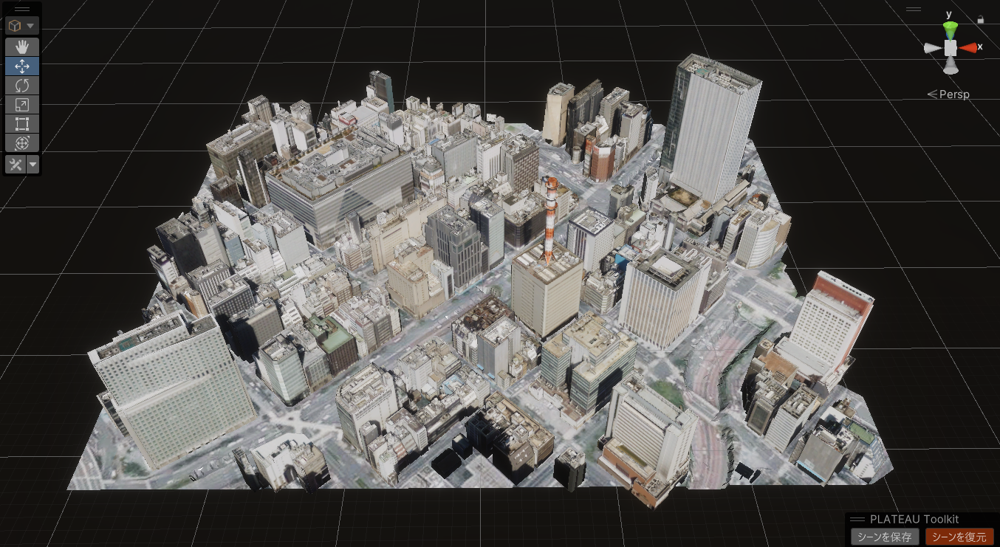

### Rendering Toolkitでの環境システムの作成
Rendering Toolkit (PLATEAU SDK-Toolkits) を使用して環境システムを作成します。ワンクリックで高品質なライティング環境がセットアップされます。

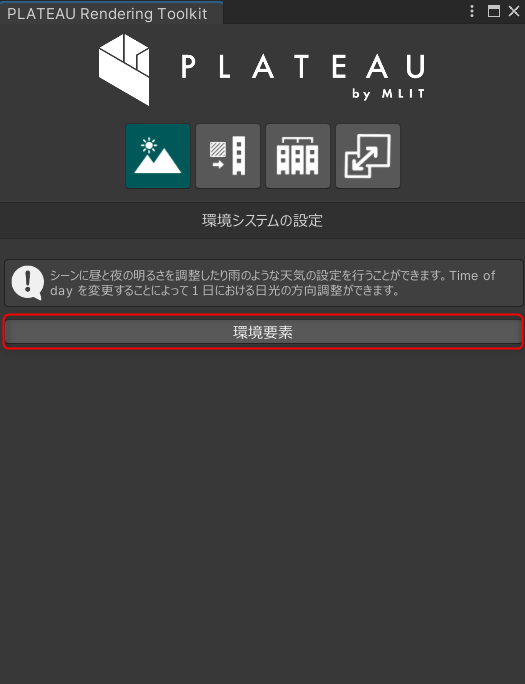

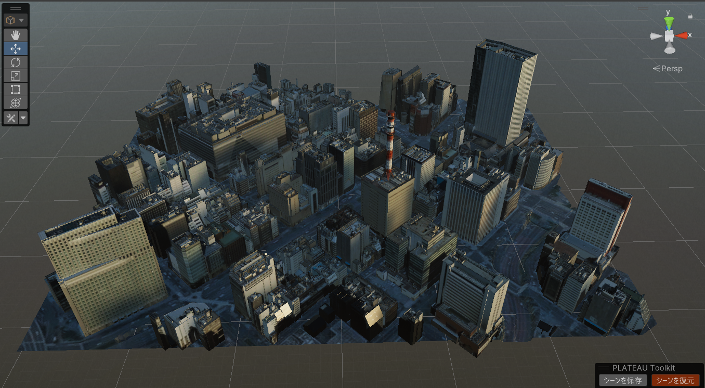

### 自動テクスチャ生成の実行
ビルを選択し、Rendering Toolkit の自動テクスチャ生成機能を実行します。環境システムの `Time of Day` スライダーを調整して時間帯を夜にすると、街灯りが灯ります。雨や雪の天候変化にも対応します。

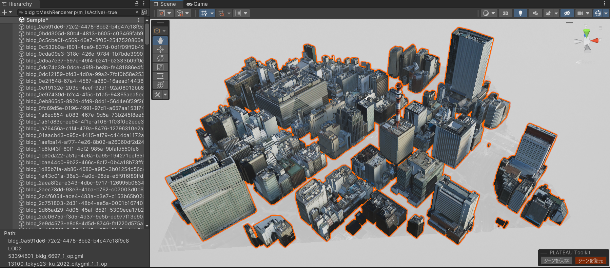
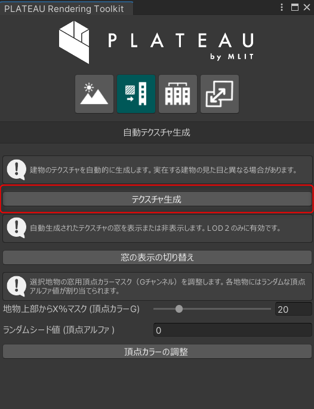
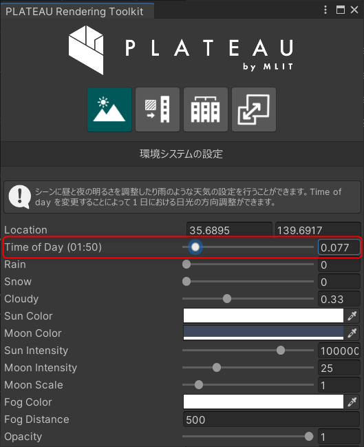


### Cesium for Unity を用いたPLATEAU地面タイルの読み込み
Cesium for Unity と PLATEAU SDK-Maps-Toolkit の位置合わせ機能を利用してPLATEAUの地面タイルを読み込み、遠景として使用します。ここまでのステップで基本的な景観設定が完了します。<br>
※ PLATEAU SDK-Maps-Toolkit の機能を使った位置合わせのやり方に関しては（[PLATEAUモデル位置合わせ - Maps Toolkit](https://github.com/Project-PLATEAU/PLATEAU-SDK-Toolkits-for-Unity/blob/main/maps_toolkit.md#1-plateau%E3%83%A2%E3%83%87%E3%83%AB%E4%BD%8D%E7%BD%AE%E5%90%88%E3%82%8F%E3%81%9B)）をご確認ください。

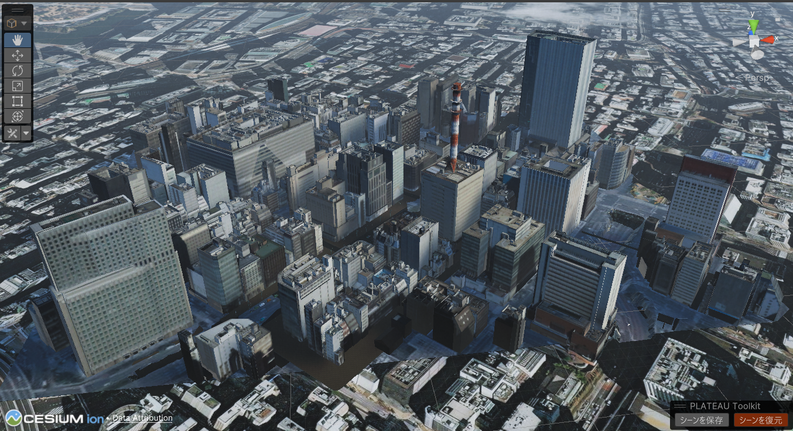<br>
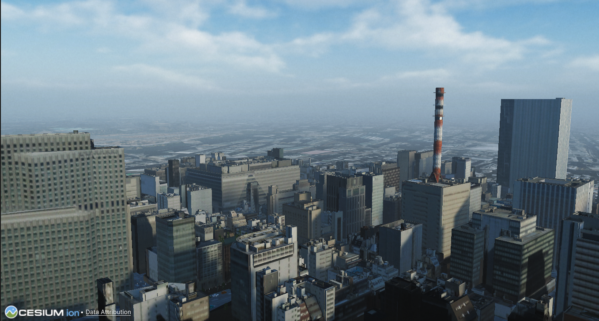<br>
<br>

### 環境システムのパラメータをアプリケーション実行時にGUIから制御
本サンプルでは環境システムのパラメータをアプリケーション実行時にGUIから制御しています。 <br>

こちらは Rendering Toolkit (PLATEAU SDK-Toolkits) の環境システムのパラメータになります。スクリプトを作成することでアプリケーション実行時の制御が可能です。<br>
※ 各パラメータについての詳しい説明は[Rendering Toolkit 利用マニュアル](https://github.com/Project-PLATEAU/PLATEAU-SDK-Toolkits-for-Unity/blob/main/rendering_toolkit.md)のページをご覧ください。 

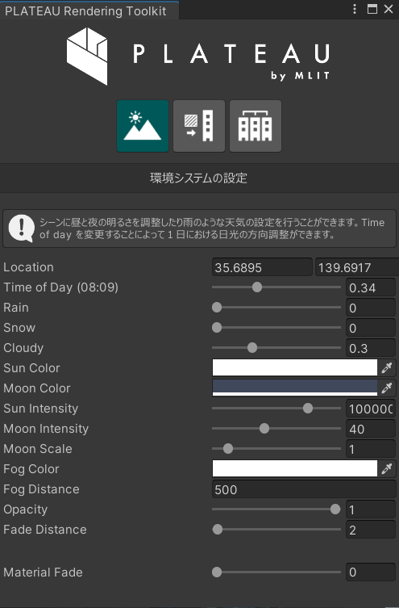

<br>

(例) アプリケーション実行時、GUIから環境システムのパラメータを制御 


以下にサンプルに実装された時間の変更をGUIで制御するコードと天候の変更をGUIで制御するコードを紹介します。

以下のコードは `TimeOfDaySliderController` コンポーネントを示しています。このコンポーネントは、時間の変更を制御するためのスライダーの値が変更されたときに、環境システムにその値を反映させます。

```csharp
using UnityEngine;
using UnityEngine.UI;
using PlateauToolkit.Rendering;

namespace PlateauSamples.UrbanScape
{
    public class TimeOfDaySliderController : MonoBehaviour
    {
        [SerializeField] Slider m_Slider;
        EnvironmentController m_EnvironmentController;

        void Awake()
        {
            if (m_Slider == null)
            {
                return;
            }

            m_EnvironmentController = FindObjectOfType<EnvironmentController>();
            if (m_EnvironmentController == null)
            {
                return;
            }

            m_Slider.onValueChanged.AddListener(HandleSliderValueChanged);
        }

        public void HandleSliderValueChanged(float value)
        {
            m_EnvironmentController.m_TimeOfDay = value;
        }

        void OnDestroy()
        {
            if (m_Slider != null)
            {
                m_Slider.onValueChanged.RemoveListener(HandleSliderValueChanged);
            }
        }
    }
}
```
<br>

`TimeOfDaySliderController` クラス内で、スライダーの値に応じて環境の時間帯を変更する重要な部分は以下の通りです。<br>
このメソッド `HandleSliderValueChanged` は、ユーザーがGUI上でスライダーを操作するときに呼び出されます。スライダーの値 ( `value` ) は 環境システムの `TimeOfDay` パラメータに設定され、これにより環境システムの時間帯が変更されます。

```csharp
public class TimeOfDaySliderController : MonoBehaviour
{
    // ...

    // 時間帯スライダーの値が変更された時の処理
    public void HandleSliderValueChanged(float value)
    {
        // スライダーの値を環境システムの時間帯のパラメータ(TimeOfDay)に反映
        m_EnvironmentController.m_TimeOfDay = value;
    }

    // ...
}
```
<br>

以下に示すのは `WeatherSliderController` コンポーネントを示しています。このコンポーネントでは、雨、雪、曇りの各スライダーの値に応じて環境システムの天候を制御します。

```csharp
using UnityEngine;
using UnityEngine.UI;
using PlateauToolkit.Rendering;

namespace PlateauSamples.UrbanScape
{
    public class WeatherSliderController : MonoBehaviour
    {
        [SerializeField] Slider m_RainSlider;
        [SerializeField] Slider m_SnowSlider;
        [SerializeField] Slider m_CloudySlider;
        [SerializeField] CanvasGroup m_CanvasGroup;
        EnvironmentController m_EnvironmentController;

        void Awake()
        {
            m_EnvironmentController = FindObjectOfType<EnvironmentController>();
            if (m_EnvironmentController == null)
            {
                return;
            }
        }

        void Start()
        {
            m_RainSlider.onValueChanged.AddListener(HandleRainSliderChanged);
            m_CloudySlider.onValueChanged.AddListener(HandlecloudySliderChanged);
            m_SnowSlider.onValueChanged.AddListener(HandleSnowSliderChanged);
        }

        void HandleRainSliderChanged(float value)
        {
            if (m_CanvasGroup.alpha > 0)
            {
                m_EnvironmentController.m_Rain = value;
            }
        }

        void HandlecloudySliderChanged(float value)
        {
            if (m_CanvasGroup.alpha > 0)
            {
                m_EnvironmentController.m_Cloud = value;
            }
        }

        void HandleSnowSliderChanged(float value)
        {
            if (m_CanvasGroup.alpha > 0)
            {
                m_EnvironmentController.m_Snow = value;
            }
        }

        void OnDestroy()
        {
            m_RainSlider.onValueChanged.RemoveListener(HandleRainSliderChanged);
            m_CloudySlider.onValueChanged.RemoveListener(HandlecloudySliderChanged);
            m_SnowSlider.onValueChanged.RemoveListener(HandleSnowSliderChanged);
        }
    }
}
```
<br>

`WeatherSliderController` クラス内で、各スライダー（雨、曇り、雪）の値に応じて環境システムのパラメータを変更する重要な部分は以下の通りです。<br>
この各メソッドは、ユーザーがGUI上のスライダーを操作するときに呼び出されます。スライダーの値 ( `value` ) は 環境システムの（雨、曇り、雪） パラメータに設定され、これにより環境システムの天候が変更されます。

```csharp
public class WeatherSliderController : MonoBehaviour
{
    // ...

    // 雨スライダーの値が変更された時の処理
    void HandleRainSliderChanged(float value)
    {
        if (m_CanvasGroup.alpha > 0)
        {
            // スライダーの値を環境システムの雨のパラメータ(Rain)に反映
            m_EnvironmentController.m_Rain = value;
        }
    }

    // 曇りスライダーの値が変更された時の処理
    void HandlecloudySliderChanged(float value)
    {
        if (m_CanvasGroup.alpha > 0)
        {
            // スライダーの値を環境システムの曇りのパラメータ(Cloud)に反映
            m_EnvironmentController.m_Cloud = value;
        }
    }

    // 雪スライダーの値が変更された時の処理
    void HandleSnowSliderChanged(float value)
    {
        if (m_CanvasGroup.alpha > 0)
        {
            // スライダーの値を環境システムの雪のパラメータ(Snow)に反映
            m_EnvironmentController.m_Snow = value;
        }
    }

    // ...
}
```

これらのコンポーネントは "Canvas/ViewerPanel" ゲームオブジェクトにアタッチされています。 <br>
コンポーネントにはGUIの時間帯を制御するスライダーと天候(雨、雪、曇り)を制御するスライダーのゲームオブジェクトが割り当てられています。 <br>
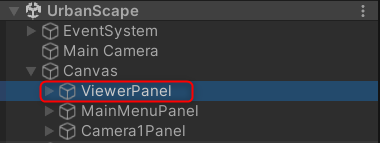<br>
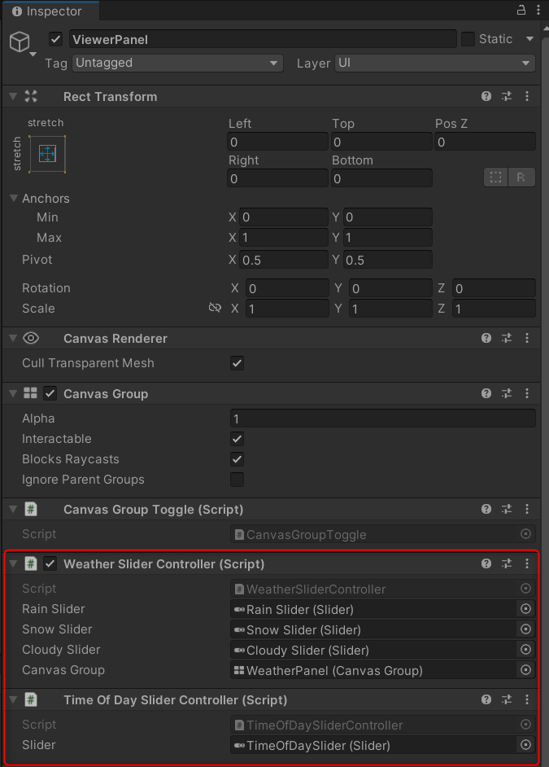

### 窓の調整
ビルの形状によっては窓が不自然に見える場合があるため、RenderingToolkitの窓の調整機能を使用して調整が可能です。

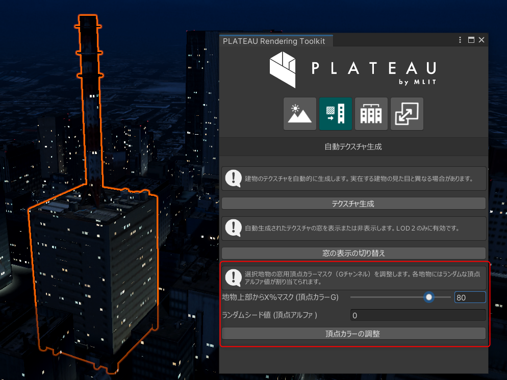

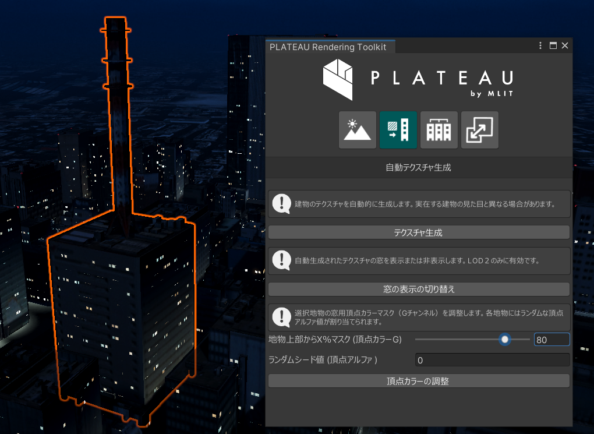

## 4-2. 道路や地面の調整のTips

### 地面の修正
PLATAEUの地形モデルは航空測量によって1メートル～10メートルのメッシュで作成されているため、凸凹があります。
現実の地形を再現する必要がない場合、地形が平滑化されている方が自然な見た目になります。
そこで、 **Unity ProBuilder** を使用して地形モデルのメッシュを修正します。まずは地面のメッシュを ProBuilder で編集可能なオブジェクトに変換します。
尚、Cesium for Unity から取得した地形モデル (Terrain) は編集できませんので、ここではPLATEAU SDKを用いてインポートした地形モデルを用います。

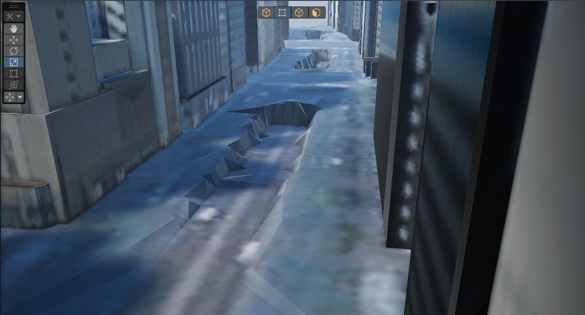
<br><br>

地形モデルのメッシュを選択して "メニュー" >  "Tools" > "ProBuilder" > "ProBuilder Window" > "Probuilderize"　を実行します。

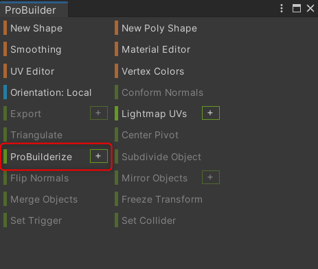
<br><br>

凹んでいる箇所の頂点群を選択してY軸に対してスケーリングを行うと、凹んでいる箇所の頂点がフラットになります。これを必要な部分に行い地面のクリーンアップは完了です。<br>
 <br>
<br>
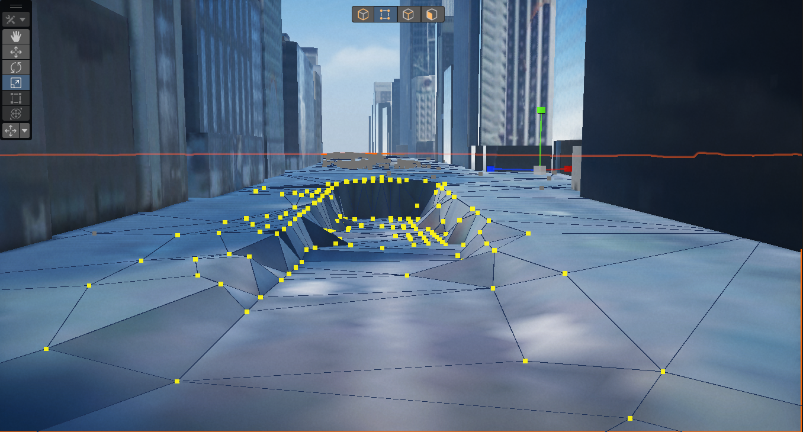<br>
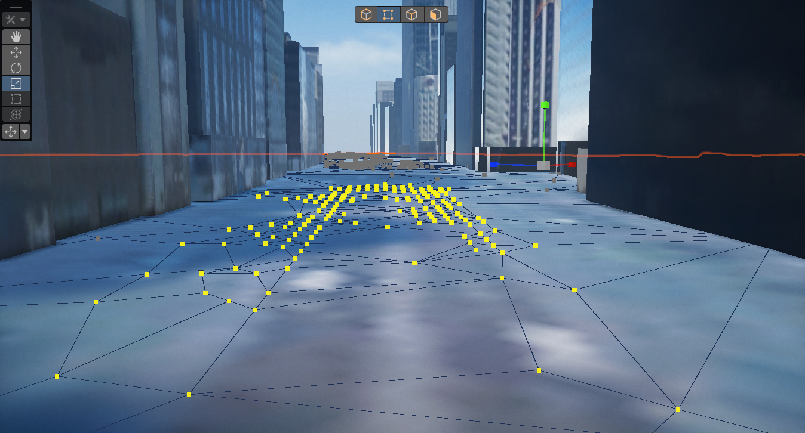<br>
<br>
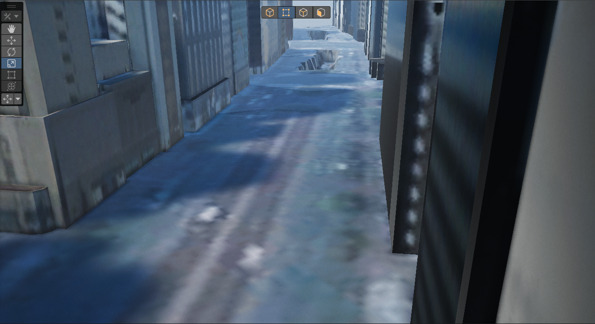<br>
<br>

### 道路の修正
PLATEAUの道路モデルを地面の上に移動します。道路モデルのLOD1-2は高さを持たないフラットなメッシュのため、必要に応じて適宜 ProBuilder で調整を行います。<br>


次にサンプルの "Materials" フォルダーに用意された、 "Common_Asphalt_01_MAT" マテリアルを適用します。<br>
プラナーマッピングという手法で、UVマッピングが存在しない場合でもテクスチャの模様を平面的に張ることが可能です。<br>
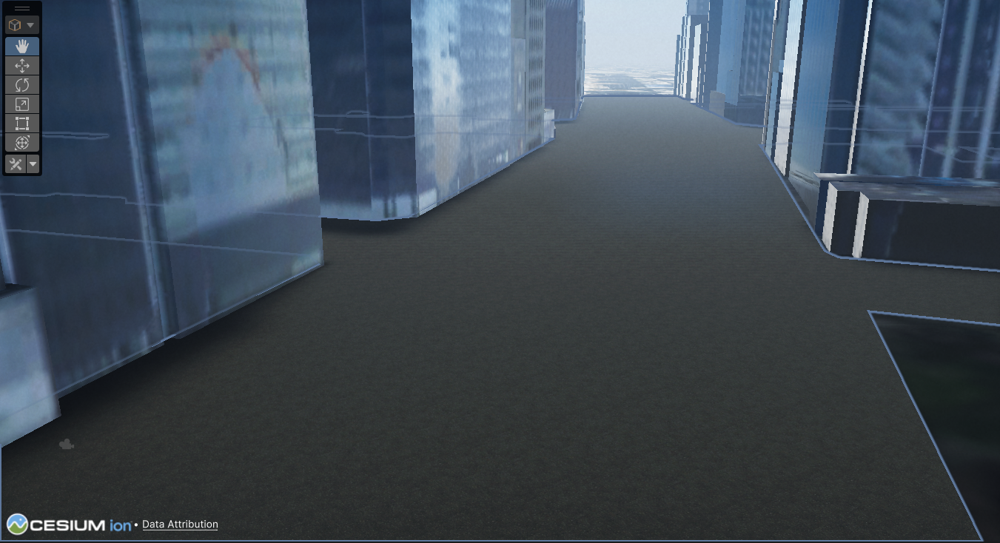

プラナーマッピングへの変更方法に関してはマテリアルの `Base UV Set` パラメータを `Planar` に設定します。<br>
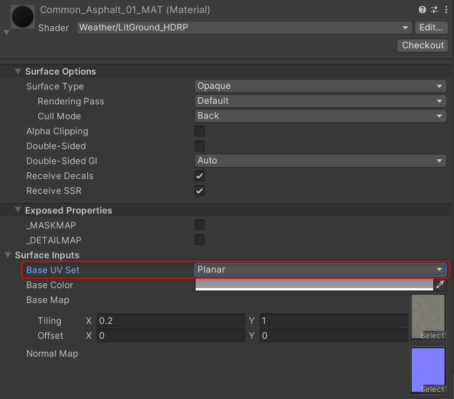
<br>

※ プラナーマッピングの手法に関しての解説は Unity Japan の動画 [「投影マッピングを使ったテクスチャーテクニック」](https://www.youtube.com/watch?v=nMAMniAlJJ4)をご覧ください。<br>
解説動画では、トリプラナーマッピングについても解説されています。トリプラナーマッピングを使用したい場合は。マテリアルの `Base UV Set` パラメータを `Triplanar` に変更してください<br>fan
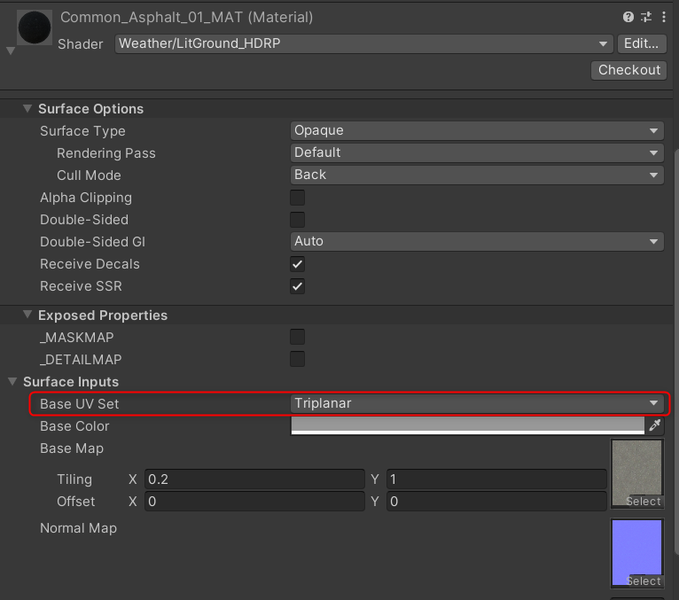

### 建物の下のタイル敷設
SandboxToolkit標準のアセットを使用して建物の下にタイルを配置していきます。<br>
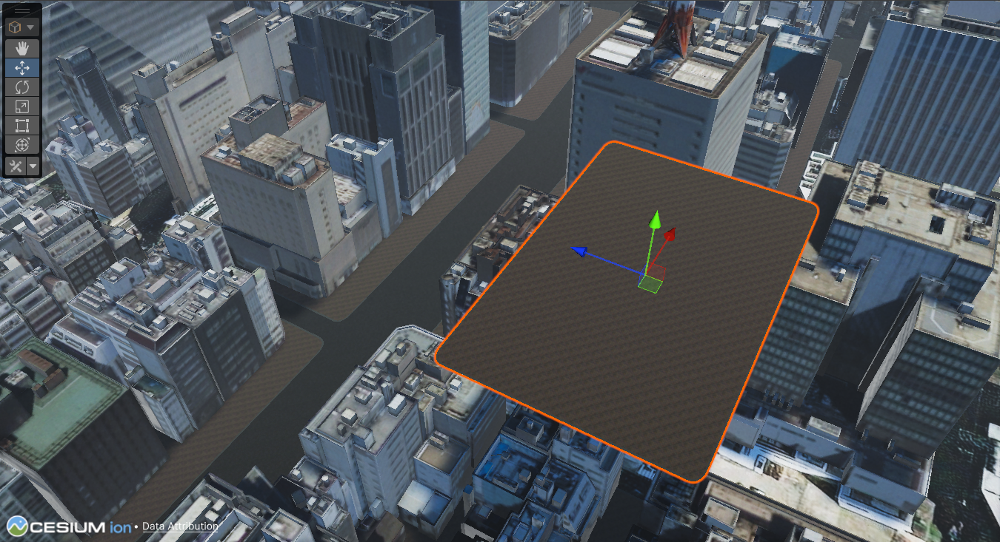

今回配置したアセットは「Prop_Tile_01」になります。<br>
配置方法に関しての詳しい解説は[Sandbox Toolkit 利用マニュアル](https://github.com/Project-PLATEAU/PLATEAU-SDK-Toolkits-for-Unity/blob/main/sandbox_toolkit.md)のページをご覧ください <br>
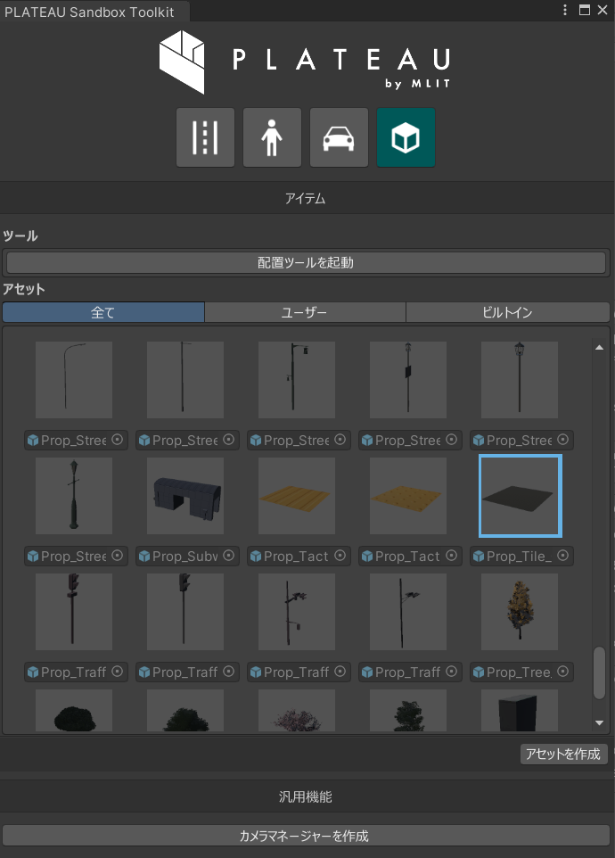 <br>
> **Note**
> ※ 当サンプルリリース時点では「Unity 2021.3.30f1」を使用しておりますが、UnityEditorの不具合で、Sandboxの標準アセットのアイコン表示が黒くなってしまうバグが報告されております。<br>
もし発生した場合はUnity 2021.3.31f1にアップデートすることで改善されます。次回アップデートにて当サンプルもUnityEditorのバージョンアップを実施予定です。
<br>

また、必要な場合は建物の形状に合わせて適宜 ProBuilder で調整を行います。<br>
当サンプルでは、Unity標準のトランスフォームのスケールを変更して大きさを調整しています。<br>
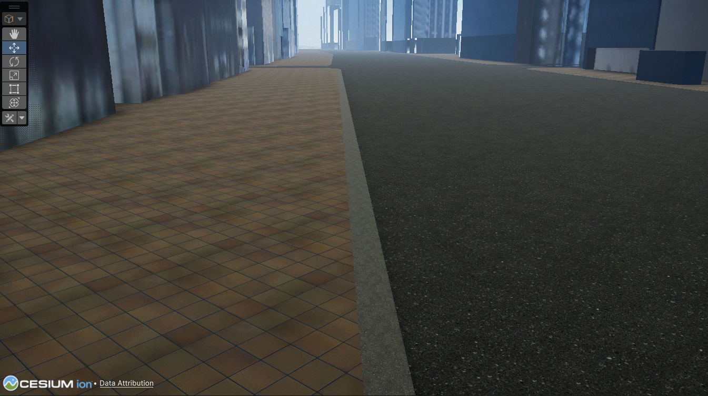<br>
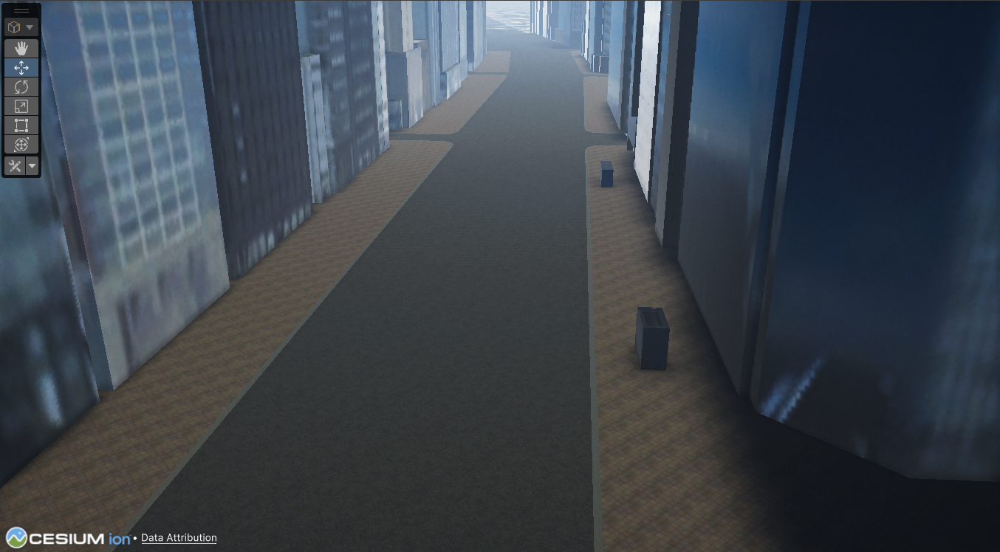
<br>

### センターラインの配置
Sandbox Toolkit (PLATEAU SDK-Toolkits) のインスタンス配置機能 ( `PlateauSandboxTrackInstantiate` ) を使用してトラックに沿ってセンターラインを配置します。
<br>

Sandbox Toolkitを用いてトラックを作成します。
<br>
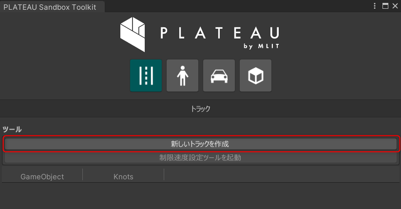

作成したトラックに `PlateauSandboxTrackInstantiate` コンポーネントを割り当てます。<br>
※ こちらのコンポーネントを使用したインスタンス配置に関しては、Sandbox Toolkitの標準機能になります。詳しい使い方に関しては[Sandbox Toolkit 利用マニュアル](https://github.com/Project-PLATEAU/PLATEAU-SDK-Toolkits-for-Unity/blob/main/sandbox_toolkit.md)のページもご覧ください。
<br>
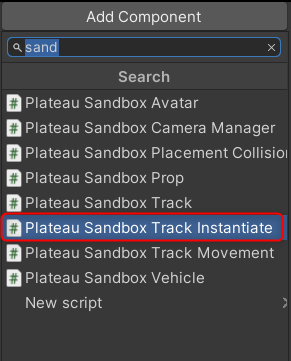
<br><br>

Sandbox Toolkitのビルトインアセットの「Prop_Marking_StraightLine_01」を<br>
追加したコンポーネントの「生成アイテムリスト」にドラッグアンドドロップし、インスタンス配置したいオブジェクトを登録します。
<br>
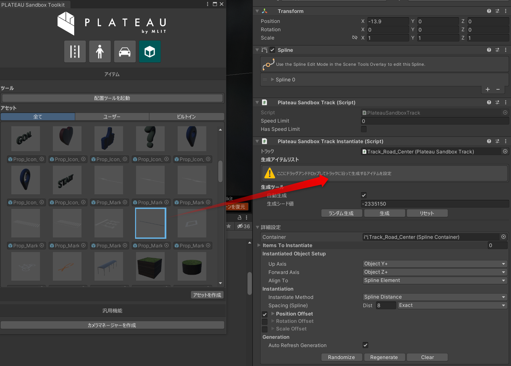
<br>
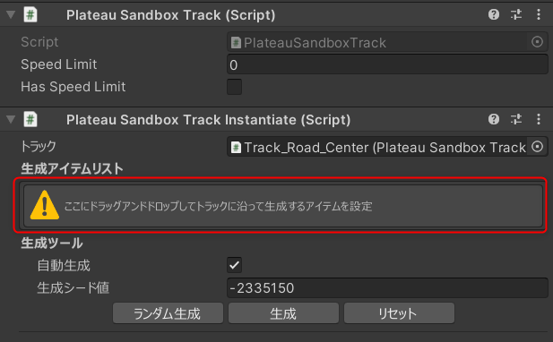
<br>
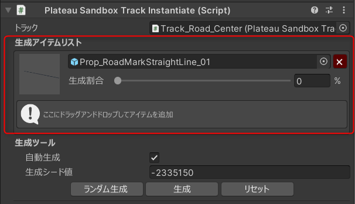
<br><br>

コンポーネントの下の方の詳細設定の `Spacing` を調整することで配置の間隔を調整することができます。
<br>


また、 `Position Offset` のチェックボックスをオンにすると配置位置のオフセットを調整することができます。
<br>
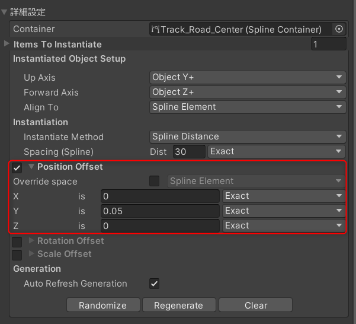
<br>

これでセンターラインの配置は完了です。
<br>
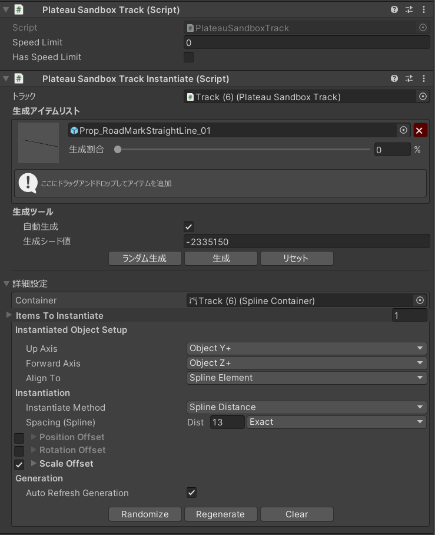<br>
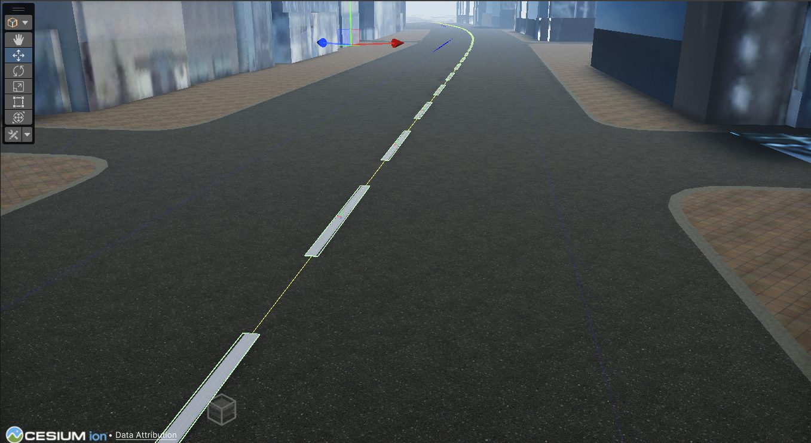<br>
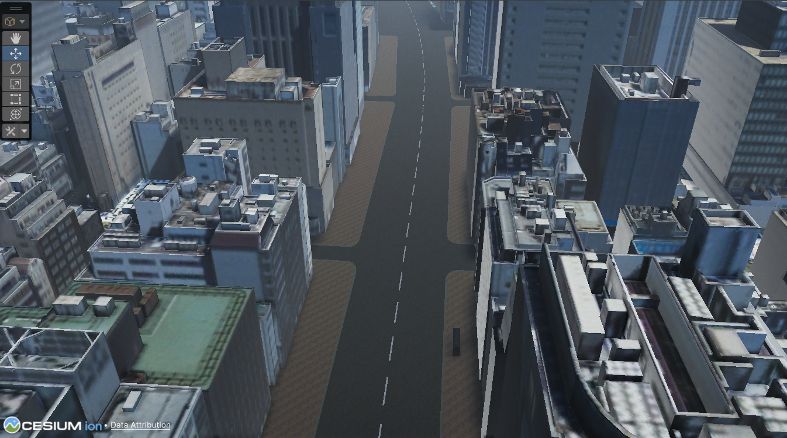
<br>

### ProBuilderのインストール方法

ProBuilder は Unity公式のモデリングツールで、ポリゴンベースのモデリング、テクスチャリング、編集作業をUnityエディター内で簡単に行うことができます。これを使用するためには、Unityのパッケージマネージャーからインストールする必要があります。

1. Unityエディター内で「Window」メニューを開き、「Package Manager」を選択します。
2. パッケージマネージャーウィンドウで「ProBuilder」を検索します。
3. ProBuilder パッケージを見つけたら、「Install」ボタンを押下してインストールを開始します。
  
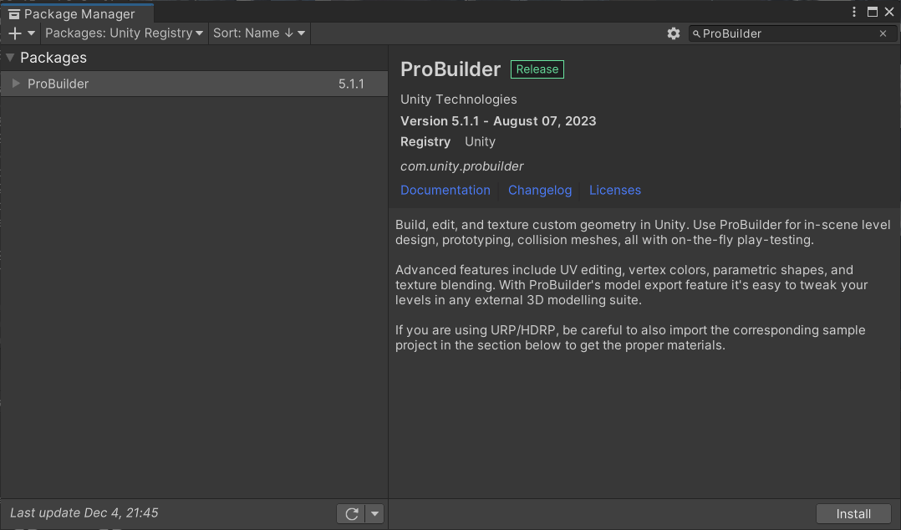
<br>

### ヒエラルキーのカスタム選択機能の使用例

Unityのヒエラルキーでのカスタム選択機能は、複雑な階層を持つシーンで、特定のコンポーネントやタグを持つオブジェクトを一括で選択するのに役立ちます。カスタム選択機能を使用するには "メニュー" > "Edit" > "Preferences" の "Search" タブで "Scene" を "Advanced" に設定してください。

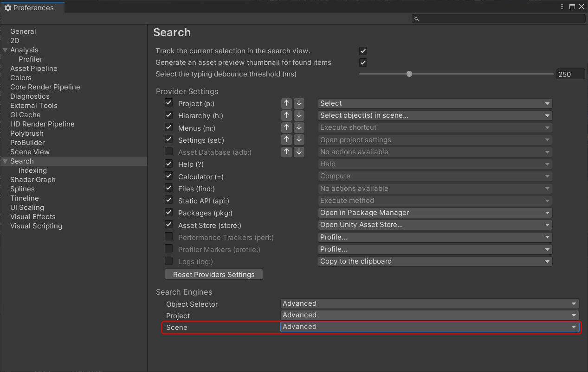

- 使用例: ヒエラルキーパネルの検索バーに特定の条件を入力します。例えば、「t:MeshRenderer」と入力すると、すべてのメッシュレンダラーを持つオブジェクトが表示されます。
- カスタム検索の利点: カスタム検索を使用することで、プロジェクト内の特定のタイプのオブジェクトや特定の機能を持つオブジェクトをすばやく見つけることができます。
<br>

現在のシーンで表示されているPLATEAU 3D都市モデルを一括選択する場合は "bldg t:MeshRenderer p(m_IsActive)=true" と入力します。

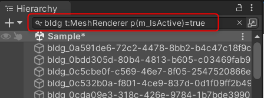
<br>

##  4-3. プロップ/アバター/乗り物の配置
Sandbox Toolkitの機能を使ってシーンにプロップ/アバター/乗り物を配置し、さまざまなカスタマイズができます。<br>
詳しくは[Sandbox Toolkit 利用マニュアル](https://github.com/Project-PLATEAU/PLATEAU-SDK-Toolkits-for-Unity/blob/main/sandbox_toolkit.md)をご確認ください。

プロップの配置<br>


アバターの配置<br>
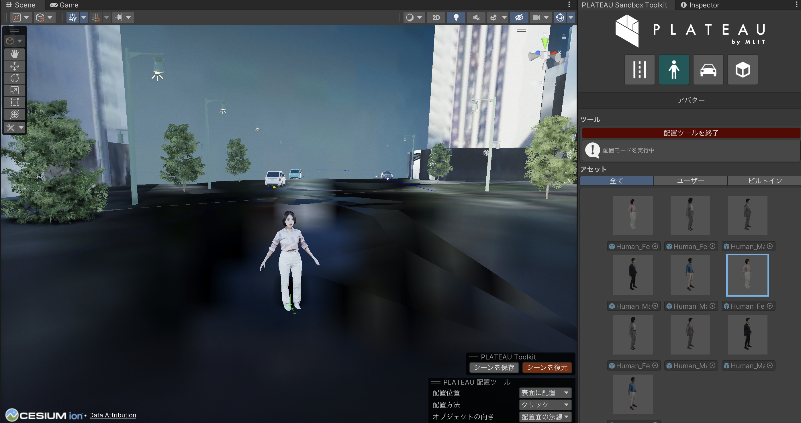

乗り物の配置<br>
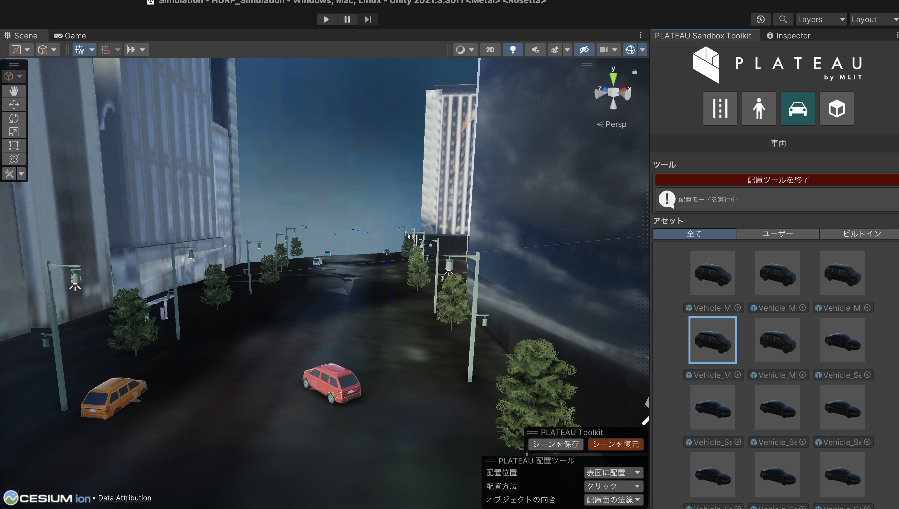

##  4-4. ポストエフェクトの適用(HDRP)
HDRPのプロジェクトでは CustomPass を使ってポストエフェクトを設定することができます。本サンプルシーンでは Toy Camera が設定されています。Custom Pass Volumeの中の `Target Camera` を変更することで、ポストエフェクトを設定するカメラを変更することが可能です。<br>

詳しくは[ポストエフェクトの使い方](https://github.com/Project-PLATEAU/PLATEAU-SDK-Toolkits-for-Unity/blob/main/rendering_toolkit.md#5-%E3%83%9D%E3%82%B9%E3%83%88%E3%82%A8%E3%83%95%E3%82%A7%E3%82%AF%E3%83%88
)をご確認ください。

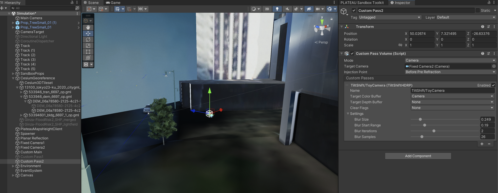
