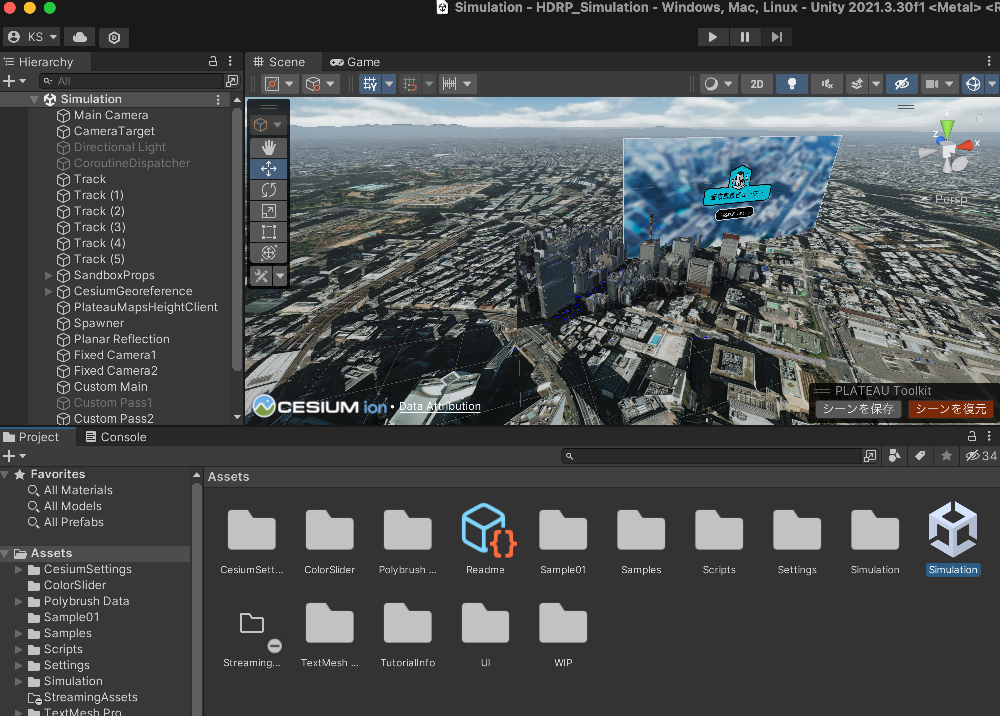
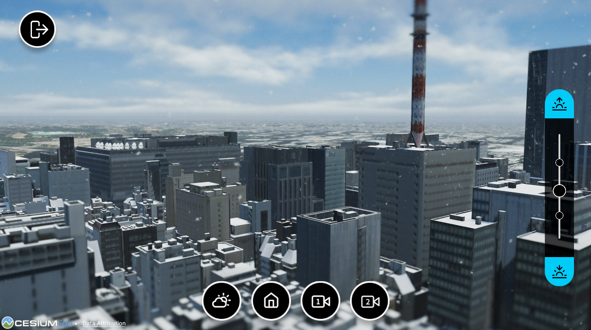
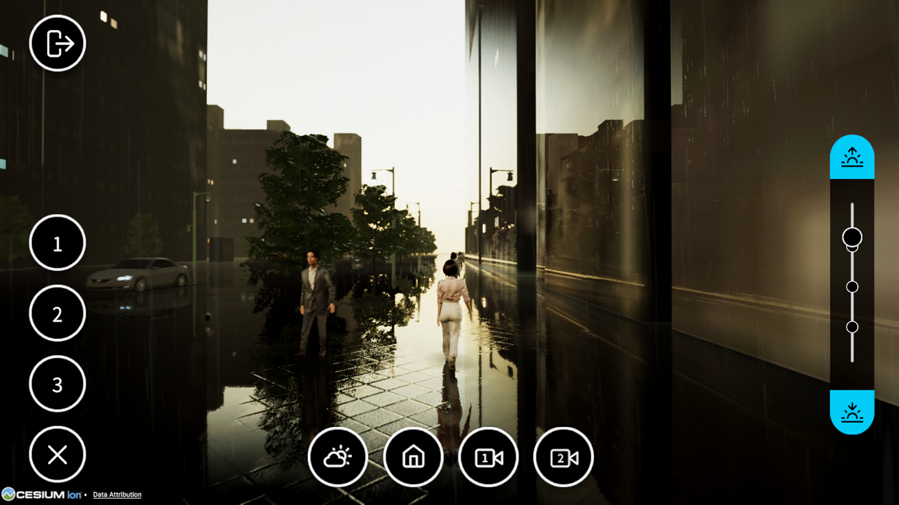
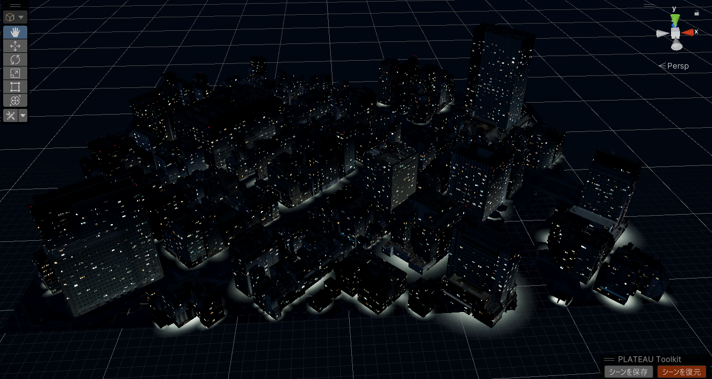
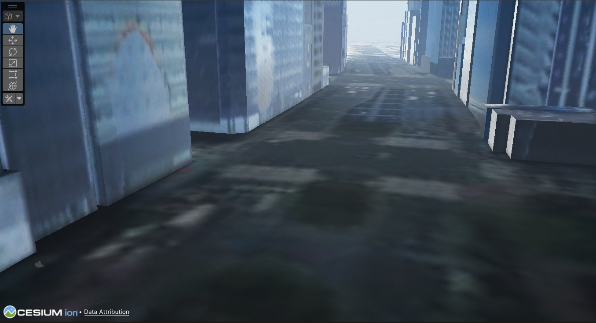
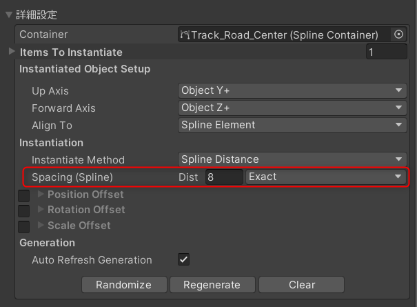

# Urban Scape


### PLATEAU-SDK-Toolkits-for-Unityを使ったサンプルアプリケーション

PLATEAU-SDK-Toolkits for Unityを用いたシミュレーションアプリケーションの作成方法についてご紹介します。

### 更新履歴

|  2023/12/22  |  UrbanScape　初回リリース|
| :--- | :--- |

# 目次

- [1. サンプルシーンの概要](#1-サンプルシーンの概要)
  * [1-1. Toolkitの利用機能](#1-1-toolkitの利用機能)
- [2. 利用手順](#2-利用手順)
  * [2-1. 必要環境](#2-1-必要環境)
  * [2-2. サンプルシーンのビルド方法](#2-2-サンプルシーンのビルド方法)
  * [2-3. ビルドしたアプリケーションの操作方法](#2-3-ビルドしたアプリケーションの操作方法)   
- [3. サンプルシーンのカスタマイズ方法](#3-サンプルシーンのカスタマイズ方法)
  * [3-1. 3D都市モデルの変更](#3-1-3d都市モデルの変更)
- [4. 3D都市モデルを使った都市景観作成時のTips](#4-3D都市モデルを使った都市景観作成時のTips)
  * [4-1. サンプル都市モデルの作成](#4-1-サンプル都市モデルの作成)
  * [4-2. 道路や地面の調整のTips](#4-2-道路や地面の調整のTips)
  * [4-3. プロップ/アバター/乗り物の配置](#4-3-プロップアバター乗り物の配置)
  * [4-4. ポストエフェクトの適用(HDRP)](#4-4-ポストエフェクトの適用HDRP)

 
# 1. サンプルシーンの概要
## 1-1. 体験の概要
このサンプルシーンを使うことで、都市の景観を綺麗に見せられるようなビューアーアプリを作ることが可能です。<br>
都市でのPV作成などのユースケースを想定したサンプルプロジェクトです。<br>

## 1-2. 利用されているToolkitsの機能


### Rendering Toolkit
- 天候の変更
- 時間変更
- ポストエフェクト

### Sandbox Toolkit
- 人の配置
- 車の配置
- Propsの配置

### Maps Toolkit
- Cesiumを使ったPLATEAUモデルの位置合わせ


# 2. 利用手順
## 2-1. 推奨環境
### OS環境
- Windows11
- macOS Ventura 13.2

### Unity Version
- Unity 2021.3.30


### Rendering Pipeline
- HDRP
- URP

Built-in Rendering Pipelineでは動作しません。<br>

## 2-2. サンプルシーンのビルド方法

①Assets/Scenes/UrbanScapeを開きます。<br>



②最初にHDRPに関してのウィザードが表示されることがありますが、閉じてください。<br>


③メニューよりFile > Build Settingsを選択します。<br>


③Windows, Mac以外になっている場合は、Windows, Macを選択して、画面下部にある「Switch Platform」ボタンを押下し、Platformを切り替えます。<br>
④画面下部にある「Build」ボタンを押下します。出力先を選択してビルドを開始します。


## 2-3. ビルドしたアプリケーションの操作方法

①ビルドしたアプリケーションを開くと、オープニング画面が表示されます。<br>
「始めましょう」ボタンを押下してください。<br>


②ホームビューに遷移します。このビューではマウス操作によってカメラを回転させることができます。<br>
<br>

<br><br>

③画面右の時間帯変更スライダーを調整すると、シーンの時間帯を変更することができます。<br>
<br>

<br><br>


④天候ボタンを押下すると、各天候を調整するためのスライダーが表示されます。スライダーを動かすことで天候の変化が可能です。<br>
<br>
<br>
<br>


⑤固定カメラ１ボタンを押下すると、人や車の通行が確認できる定点カメラビューに遷移します。<br>


⑤固定カメラ２ボタンを押下すると、俯瞰視点の定点カメラビューに遷移します。このカメラには「トイカメラ」のポストエフェクトが適用されています。<br>


⑥ホームボタンを押すと、ホームビューに戻ります。<br>

<br>

⑦歩いているHumanや走っているVehicleをクリックすると、カメラインタラクションモードに入ります。左に表示される数字ボタンを押すと視点を切り替えることができます。<br>

「1」ボタンを押下すると一人称視点モードに変わります。<br>



「2.」ボタンを押下すると三人称視点モードに変わります。<br>


「3」ボタンを押下すると見回しモードに変わります。<br>


詳しくはSandbox Toolkitの[カメラインタラクションについて](https://github.com/unity-shimizu/PLATEAU-SDK-Toolkits-for-Unity/blob/main/PlateauToolkit.Sandbox/README.md#3-%E3%82%AB%E3%83%A1%E3%83%A9%E3%82%A4%E3%83%B3%E3%82%BF%E3%83%A9%E3%82%AF%E3%82%B7%E3%83%A7%E3%83%B3%E6%A9%9F%E8%83%BD)をご確認ください。


# 3. サンプルシーンのカスタマイズ方法
## 3-1. 3D都市モデルの変更

シーンをカスタマイズし、PLATEAU都市モデルや配置物を変更したい場合は"Assets/Simulation.unity"をひらき、シーンを編集します。


<br><br>

PLATEAU都市モデルを変更する場合はヒエラルキーの中の"CesiumGeoreference"の中にあるPLATEAU都市モデルを削除した上で、ご自身でインポートしたPLATEU都市モデルを同じ場所に配置してください。


> **Note**
> PLATEAUの都市モデルのインポートはPLATEAU SDK for Unityを利用して行ってください。
> （[都市モデルのインポート](https://project-plateau.github.io/PLATEAU-SDK-for-Unity/manual/ImportCityModels.html)）
> 本サンプルで使われているPLATEAUモデル位置合わせ機能はMaps Toolkitの機能です。（[PLATEAUモデル位置合わせ - Maps Toolkit](https://github.com/Project-PLATEAU/PLATEAU-SDK-Toolkits-for-Unity/blob/main/maps_toolkit.md#1-plateau%E3%83%A2%E3%83%87%E3%83%AB%E4%BD%8D%E7%BD%AE%E5%90%88%E3%82%8F%E3%81%9B)）


# 4. 3D都市モデルを使った都市景観作成時のTips
3D都市モデルを使って都市景観を作成する際には、利用するデバイスに応じてモデルを最適化することが重要です。
また、テクスチャを差し替えたり、現実の都市空間にあるものをプロップスとして配置したりするなどの工夫で外観のクオリティを高めることができます。
本セクションでは、このサンプルシーンを構築する際に行った景観クオリティ向上のための手順をご紹介します。

## 4-1. サンプル都市モデルの作成

### PlateauSDKでの都市モデルの読み込み
PlateauSDKを使用して都市モデルを読み込みます。
サンプルでは、建築物モデルLOD2、地形モデルLOD1、道路モデルLOD1を配置しました。
地形モデルに対しては、PLATEAU SDKの機能を用いて空中写真を張り付けています。


### RenderingToolkitでの環境システムの作成
RenderingToolkitを使用して環境システムを作成します。ワンクリックで高品質なライティング環境がセットアップされます。


### AutoTexturingの実行
ビルを選択し、RenderingToolkitのAutoTexturing機能を実行します。環境システムの Time of Day スライダーを調整して時間帯を夜にすると、街灯りが灯ります。雨や雪の天候変化にも対応します。





### CesiumでのPlateau地面タイルの読み込み
CesiumとMapsToolkitの位置合わせ機能を利用してPlateauの地面タイルを読み込み、遠景として使用します。ここまでのステップで基本的な景観設定が完了します。<br>
※MapsToolkitの機能を使った位置合わせのやり方に関しては（[PLATEAUモデル位置合わせ - Maps Toolkit](https://github.com/Project-PLATEAU/PLATEAU-SDK-Toolkits-for-Unity/blob/main/maps_toolkit.md#1-plateau%E3%83%A2%E3%83%87%E3%83%AB%E4%BD%8D%E7%BD%AE%E5%90%88%E3%82%8F%E3%81%9B)）をご確認ください。

<br>
<br>
<br>

### 環境システムのパラメーターをランタイムでGUIから制御
本サンプルでは環境システムのパラメータをランタイムでGUIから制御しています。 <br>

こちらはRenderingToolkitの環境システムのパラメーターになります。スクリプトを作成することでランタイムでの制御が可能です。<br>
※各パラメーターについての詳しい説明は[Rendering Toolkit 利用マニュアル](https://github.com/Project-PLATEAU/PLATEAU-SDK-Toolkits-for-Unity/blob/main/rendering_toolkit.md)のページをご覧ください。 


ランタイムGUIから環境システムのパラメーターを制御 <br>


以下にサンプルに実装された時間の変更をGUIで制御するコードと天候の変更をGUIで制御するコードをご紹介します。

以下のコードは `TimeOfDaySliderController` コンポーネントを示しています。このコンポーネントは、時間の変更を制御するためのスライダーの値が変更されたときに、環境システムにその値を反映させます。

```csharp
using UnityEngine;
using UnityEngine.UI;
using PlateauToolkit.Rendering;

namespace PlateauSamples.UrbanScape
{
    public class TimeOfDaySliderController : MonoBehaviour
    {
        [SerializeField] Slider m_Slider;
        EnvironmentController m_EnvironmentController;

        void Awake()
        {
            if (m_Slider == null)
            {
                return;
            }

            m_EnvironmentController = FindObjectOfType<EnvironmentController>();
            if (m_EnvironmentController == null)
            {
                return;
            }

            m_Slider.onValueChanged.AddListener(HandleSliderValueChanged);
        }

        public void HandleSliderValueChanged(float value)
        {
            m_EnvironmentController.m_TimeOfDay = value;
        }

        void OnDestroy()
        {
            if (m_Slider != null)
            {
                m_Slider.onValueChanged.RemoveListener(HandleSliderValueChanged);
            }
        }
    }
}
```
<br>
TimeOfDaySliderController` クラス内で、スライダーの値に応じて環境の時間帯を変更する重要な部分は以下の通りです。<br>
このメソッド HandleSliderValueChanged は、ユーザーがUIスライダーを操作するときに呼び出されます。スライダーの値（value）は 環境システムの TimeOfDay パラメーターに設定され、これにより環境システムの時間帯が変更されます。

```csharp
public class TimeOfDaySliderController : MonoBehaviour
{
    // ...

    // 時間帯スライダーの値が変更された時の処理
    public void HandleSliderValueChanged(float value)
    {
        // スライダーの値を環境システムの時間帯のパラメーター(TimeOfDay)に反映
        m_EnvironmentController.m_TimeOfDay = value;
    }

    // ...
}
```
<br>

以下に示すのは `WeatherSliderController` コンポーネントのコードです。このコンポーネントでは、雨、雪、曇りの各スライダーの値に応じて環境システムの天候を制御します。

```csharp
using UnityEngine;
using UnityEngine.UI;
using PlateauToolkit.Rendering;

namespace PlateauSamples.UrbanScape
{
    public class WeatherSliderController : MonoBehaviour
    {
        [SerializeField] Slider m_RainSlider;
        [SerializeField] Slider m_SnowSlider;
        [SerializeField] Slider m_CloudySlider;
        [SerializeField] CanvasGroup m_CanvasGroup;
        EnvironmentController m_EnvironmentController;

        void Awake()
        {
            m_EnvironmentController = FindObjectOfType<EnvironmentController>();
            if (m_EnvironmentController == null)
            {
                return;
            }
        }

        void Start()
        {
            m_RainSlider.onValueChanged.AddListener(HandleRainSliderChanged);
            m_CloudySlider.onValueChanged.AddListener(HandlecloudySliderChanged);
            m_SnowSlider.onValueChanged.AddListener(HandleSnowSliderChanged);
        }

        void HandleRainSliderChanged(float value)
        {
            if (m_CanvasGroup.alpha > 0)
            {
                m_EnvironmentController.m_Rain = value;
            }
        }

        void HandlecloudySliderChanged(float value)
        {
            if (m_CanvasGroup.alpha > 0)
            {
                m_EnvironmentController.m_Cloud = value;
            }
        }

        void HandleSnowSliderChanged(float value)
        {
            if (m_CanvasGroup.alpha > 0)
            {
                m_EnvironmentController.m_Snow = value;
            }
        }

        void OnDestroy()
        {
            m_RainSlider.onValueChanged.RemoveListener(HandleRainSliderChanged);
            m_CloudySlider.onValueChanged.RemoveListener(HandlecloudySliderChanged);
            m_SnowSlider.onValueChanged.RemoveListener(HandleSnowSliderChanged);
        }
    }
}
```
<br>
WeatherSliderController クラス内で、各スライダー（雨、曇り、雪）の値に応じて環境システムのパラメーターを変更する重要な部分は以下の通りです。<br>
この各メソッドは、ユーザーがUIスライダーを操作するときに呼び出されます。スライダーの値（value）は 環境システムの（雨、曇り、雪） パラメーターに設定され、これにより環境システムの天候が変更されます。

```csharp
public class WeatherSliderController : MonoBehaviour
{
    // ...

    // 雨スライダーの値が変更された時の処理
    void HandleRainSliderChanged(float value)
    {
        if (m_CanvasGroup.alpha > 0)
        {
            // スライダーの値を環境システムの雨のパラメーター(Rain)に反映
            m_EnvironmentController.m_Rain = value;
        }
    }

    // 曇りスライダーの値が変更された時の処理
    void HandlecloudySliderChanged(float value)
    {
        if (m_CanvasGroup.alpha > 0)
        {
            // スライダーの値を環境システムの曇りのパラメーター(Cloud)に反映
            m_EnvironmentController.m_Cloud = value;
        }
    }

    // 雪スライダーの値が変更された時の処理
    void HandleSnowSliderChanged(float value)
    {
        if (m_CanvasGroup.alpha > 0)
        {
            // スライダーの値を環境システムの雪のパラメーター(Snow)に反映
            m_EnvironmentController.m_Snow = value;
        }
    }

    // ...
}
```

これらのコンポーネントは Canvas > ViewerPanelゲームオブジェクトにアタッチされています。 <br>
コンポーネントにはUIの時間帯を制御するスライダーと天候(雨、雪、曇り)を制御するスライダーのゲームオブジェクトが割り当てられています。 <br>
<br>


### 窓の調整
ビルの形状によっては窓が不自然に見える場合があるため、RenderingToolkitの窓の調整機能を使用して調整が可能です。


## 4-2. 道路や地面の調整のTips

### 地面の修正
PLATAEUの地形モデルは航空測量によって１メートル～１０メートルのメッシュで作成されているため、凸凹があります。
現実の地形を再現する必要がない場合、地形が平滑化されていた方が見た目はよくなります。
そこで、Probuilderを使用して地形モデルのメッシュを修正していきます。まずは地面のメッシュをProbuilderで編集可能なオブジェクトに変換します。
なお、Cesium for Unityから取得した地形モデル（Terrain)は編集できませんので、ここではPLATEAU SDKを用いて配置した地形モデルを用います。


<br><br>

地形モデルのメッシュを選択して メニュー >  Tools > ProBuilder > ProBuilder Window > Probuilderize　を実行


<br><br>

凹んでいる箇所の頂点群を選択してY軸に対してスケーリングを行うと、凹んでいる箇所の頂点がフラットになります。これを必要な部分に行い地面のクリーンアップは完了です。<br>
 <br>
<br>
<br>
<br>
<br>
<br>
<br>

### 道路の修正
PLATEAUの道路モデルを地面の上に移動します。道路モデルのLOD1-2は高さを持たないフラットなメッシュのため、必要に応じて適宜Probuilderで調整を行います。<br>


次にサンプルのMaterialsフォルダーに用意された、「Common_Asphalt_01_MAT」マテリアルを適用します。<br>
プラナーマッピングという手法で、UVが存在しない場合でもテクスチャの模様を平面的に張ることが可能です。<br>


プラナーマッピングへの変更方法に関してはマテリアの「Base UV Set」パラメーターを「Planar」に設定します。<br>

<br>

※プラナーマッピングの手法に関しての解説はUnity Japanの動画 [「投影マッピングを使ったテクスチャーテクニック」](https://www.youtube.com/watch?v=nMAMniAlJJ4)をご覧ください。<br>
また、解説動画では、トリプラナーマッピングについても解説されています。トリプラナーマッピングを使用したい場合は。マテリアルの「Base UV Set」パラメーターを「Triplanar」に変更してください<br>


### 建物の下のタイル敷設
SandboxToolkit標準のアセットを使用して建物の下にタイルを配置していきます。<br>


今回配置したアセットは「Prop_Tile_01」になります。<br>
配置方法に関しての詳しい解説は[Sandbox Toolkit 利用マニュアル](https://github.com/Project-PLATEAU/PLATEAU-SDK-Toolkits-for-Unity/blob/main/sandbox_toolkit.md)のページをご覧ください <br>
 <br>
> **Note**
> ※ 当サンプルリリース時点では「Unity 2021.3.30f1」を使用しておりますが、UnityEditorの不具合で、Sandboxの標準アセットのアイコン表示が黒くなってしまうバグが報告されております。<br>
もし発生した場合はUnity 2021.3.31f1にアップデートすることで改善されます。次回アップデートにて当サンプルもUnityEditorのバージョンアップを実施予定です。
<br>

また、必要な場合は建物の形状に合わせて適宜Probuilderで調整を行います。<br>
当サンプルでは、Unity標準のトランスフォームのスケールの数値のみを使用して大きさを調整しています。<br>
<br>

<br>

### センターラインの配置
SandboxToolkitのインスタンス配置機能を使用してトラックに沿ってセンターラインを配置します。
<br>

SandboxToolkitからトラックを作成します。
<br>


作成したトラックに PlateauSandboxTrackInstantiate コンポーネントを割り当てます。<br>
※こちらのコンポーネントを使用したインスタンス配置に関しては、SandboxToolkitの標準機能になります。詳しい使い方に関しては[Sandbox Toolkit 利用マニュアル](https://github.com/Project-PLATEAU/PLATEAU-SDK-Toolkits-for-Unity/blob/main/sandbox_toolkit.md)のページもご覧ください。
<br>

<br><br>

SandboxToolkitのデフォルトアセットの「Prop_Marking_StraightLine_01」を<br>
追加したコンポーネントの「生成アイテムリスト」にドラッグアンドドロップし、インスタンス配置したいオブジェクトを登録します。
<br>

<br>

<br>

<br><br>

コンポーネントの下の方の詳細設定のSpacingを調整することで配置の間隔を調整することができます。
<br>


また、Position Offset のチェックボックスをONにすると配置物のトランスフォームのオフセットを調整することができます。
<br>

<br>

これでセンターラインの配置は完了です。
<br>
<br>
<br>

<br>

## Probuilderのインストール方法

ProbuilderはUnity公式のモデリングツールで、ポリゴンベースのモデリング、テクスチャリング、編集作業をUnity内で簡単に行うことができます。これを使用するためには、Unityのパッケージマネージャーからインストールする必要があります。

- ステップ1: Unityエディター内で「Window」メニューを開き、「Package Manager」を選択します。
- ステップ2: パッケージマネージャーウィンドウで「Probuilder」を検索します。
- ステップ3: Probuilderパッケージを見つけたら、「Install」ボタンをクリックしてインストールを開始します。
  

<br>

## ヒエラルキーのカスタム選択機能の使用例

Unityのヒエラルキーでのカスタム選択機能は、複雑な階層を持つシーンで、特定のコンポーネントやタグを持つオブジェクトを一括で選択するのに役立ちます。カスタム選択機能を使用するには メニュー > Edit > Preferences の SearchタブでSceneの項目をAdvancedに設定する必要があります。


- 使用例: ヒエラルキーパネルの検索バーに特定の条件を入力します。例えば、「t:MeshRenderer」と入力すると、すべてのメッシュレンダラーを持つオブジェクトが表示されます。
- カスタム検索の利点: カスタム検索を使用することで、プロジェクト内の特定のタイプのオブジェクトや特定の機能を持つオブジェクトをすばやく見つけることができます。
<br>

現在のシーンで表示されているPlateauの建物を一括選択する場合は "bldg t:MeshRenderer p(m_IsActive)=true"と入力します。


<br>


##  4-3. プロップ/アバター/乗り物の配置

Sandbox Toolkitの機能を使ってシーンにプロップ/アバター/乗り物を配置し、さまざまなカスタマイズができます。<br>
詳しくは[Sandbox Toolkit 利用マニュアル](https://github.com/Project-PLATEAU/PLATEAU-SDK-Toolkits-for-Unity/blob/main/sandbox_toolkit.md)をご確認ください。

プロップの配置<br>


アバターの配置<br>


乗り物の配置<br>


##  4-4. ポストエフェクトの適用(HDRP)

HDRPのプロジェクトではCustomPassを使ってポストエフェクトを設定することができます。本サンプルシーンではToy Cameraが設定されています。Custom Pass Volumeの中のTarget Cameraを変更することで、ポストエフェクトを設定するカメラを変更することが可能です。<br>

詳しくは[ポストエフェクトの使い方](https://github.com/Project-PLATEAU/PLATEAU-SDK-Toolkits-for-Unity/blob/main/rendering_toolkit.md#5-%E3%83%9D%E3%82%B9%E3%83%88%E3%82%A8%E3%83%95%E3%82%A7%E3%82%AF%E3%83%88
)をご確認ください。


