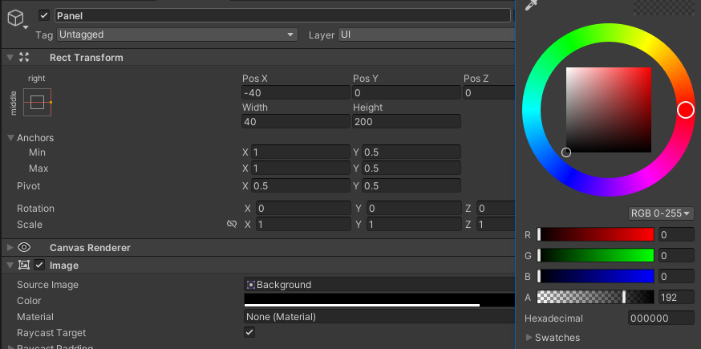
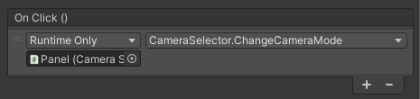
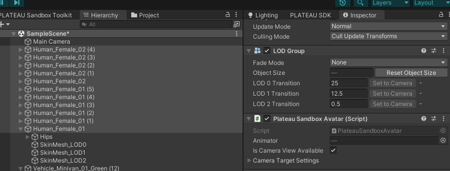

# 都市風景ビューワー　チュートリアル
     
## 目次
- [1. 都市風景ビューワー　チュートリアルの概要](#1-都市風景ビューワーチュートリアルの概要)
    - [1-1. チュートリアルの目的](#1-1-チュートリアルの目的)
    - [1-2. 開発環境](#1-2-開発環境)
    - [1-3. 準備](#1-3-準備)
- [2. 環境作成](#2-環境作成)
    - [2-1. プロジェクト作成](#2-1-プロジェクト作成)
    - [2-2. PLATEAU SDKの追加](#2-2-PLATEAU-SDKの追加)
    - [2-3. 3D都市モデルの読み込み](#2-3-3D都市モデルの読み込み)
    - [2-4. 視点移動機能の追加](#2-4-視点移動機能の追加)
    - [2-5. 初期カメラ位置の変更](#2-5-初期カメラ位置の変更)
- [3. 時間・天気コントロール機能の実装](#3-時間天気コントロール機能の実装)
    - [3-1. Rendering Toolkitの追加](#3-1-Rendering-Toolkitの追加)
    - [3-2. テクスチャ設定](#3-2-テクスチャ設定)
    - [3-3. 背景画像の追加](#3-3-背景画像の追加)
    - [3-4. 雪スライダーの設定と機能の実装](#3-4-雪スライダーの設定と機能の実装)
    - [3-5. 追加のスライダー実装](#3-5-追加のスライダー実装)
    - [3-6. 時間スライダーの追加と実装](#3-6-時間スライダーの追加と実装)
- [4. 定点カメラ機能の実装](#4-天気・時間コントロール機能の実装)
    - [4-1. 上空カメラの追加](#4-1-上空カメラの追加)
    - [4-2. カメラボタンの追加](#4-2-カメラボタンの追加)
    - [4-3. 切り替え機能の実装](#4-3-切り替え機能の実装)
- [5. 人・車モデルの実装](#5-人車モデルの実装)
    - [5-1. Sandbox Toolkitでのアイテムの追加](#5-1-Sandbox-Toolkitでのアイテムの追加)
    - [5-2. トラックの作成](#5-2-トラックの作成)
    - [5-3. オブジェクトの配置](#5-3-オブジェクトの配置)
    - [5-4. 車視点、人視点への切り替え](#5-4-車視点人視点への切り替え)
    - [5-5. 視点切り替えボタンの実装](#5-5-視点切り替えボタンの実装)
 
# 1. 都市風景ビューワー　チュートリアルの概要
## 1-1. チュートリアルの目的
PLATEAU の都市モデルを使ったユースケースでは、都市の様々なシミュレーション、まちづくりのための環境、ゲームなどが多く見られます。<br>
こういったユースケースでは、都市モデルの景観を再現するために、人や物、そして環境を整えて様々な視点からデジタル都市を再現することが求められます。<br>
このチュートリアルでは、PLATEAU SDK for Unityと PLATEAU SDK Toolkit for Unity を用いて、PLATEAU を使って都市を再現し、様々な視点で確認することが出来るアプリケーションを開発します。<br>

## 1-2. 開発環境
●	Unity Version 2021.3.27F1(LTS) 以降とVisual Studio <br>
●	PLATEAU SDK for Unity <br>
●	PLATEAU SDK toolkit for Unity <br>
(1)	Rendering Toolkit ： 都市環境の再現 <br>
(2)	Sandbox Tookit ：人や車、街路樹などのオブジェクトを配置し動かす。<br>

## 1-3. 準備
Unityの開発環境を整えます。 <br>
PLATEAU SDK for Unity をダウンロードしておきます。（第2章【2】参照） <br>
PLATEAU SDK Toolkit for Unity をダウンロードしておきます。（第3章【1】参照） <br>


# 2. 環境作成
## 2-1. プロジェクト作成
Unity Hub からプロジェクトを作成します。Unity Version 2021.3.27F1(LTS) 以降の環境で、3D(URP) を選択してプロジェクトを作成します。


## 2-2. PLATEAU SDKの追加
作成されたプロジェクトに、PLATEAU SDK for Unity を導入します。
[https://project-plateau.github.io/PLATEAU-SDK-for-Unity/manual/Installation.html](https://project-plateau.github.io/PLATEAU-SDK-for-Unity/manual/Installation.html)

## 2-3. 3D都市モデルの読み込み
PLATEAU SDKを使って、3D都市モデルをインポートします。
具体的な手順は[こちら](https://project-plateau.github.io/PLATEAU-SDK-for-Unity/manual/ImportCityModels.html)のマニュアルをご参照ください。

## 2-4. 視点移動機能の追加
マウスの右クリック&ドラッグで視点方向を、キーボードのASDWQE キーで前後左右、そして上下方向の移動する機能を実装します。
Hierarchy パネルから MainCameraを選択します。Inspector パネルで、Add Conponet を押して、CameraController と入力し、そのまま NewScript を選択、続けてCreate and Add を選択してスクリプトを作成します。<br>
<br>
<br>
Camera Controller が追加されたら、CameraController 名部分をダブルクリックしてコード作成に入ります。<br>
<br>

 下のようにコードを実装します。
 ```C#
public class CameraContoller : MonoBehaviour
{
    //回転方向の速度
    [SerializeField] float m_Sensitivity = 2.0f;
    //カメラの角度保存用
    float m_RotationX = 0.0f;
    float m_RotationY = 0.0f;

    // Start is called before the first frame update
    void Start()
    {
        //カメラの初期角度を取得
        m_RotationX = transform.eulerAngles.y;
        m_RotationY = transform.eulerAngles.x;
    }

    // Update is called once per frame
    void Update()
    {
        //右クリックが押されてドラッグしているときだけ視点方向を
        if (Input.GetMouseButton(1))
        {
            //マウスドラッグの移動量から回転方向の移動量を算出して追加
            m_RotationX += Input.GetAxis("Mouse X") * m_Sensitivity;
            m_RotationY -= Input.GetAxis("Mouse Y") * m_Sensitivity;

            //上下の角度は水平から下方向垂直近くまでに制限
            m_RotationY = Mathf.Clamp(m_RotationY, 0f, 80f);

            //カメラの角度としてセット
            transform.rotation = Quaternion.Euler(m_RotationY, m_RotationX, 0);
        }
    }
}
```
さらに、以下のようなコードを追加すると、カーソルキーでの移動もできるようになります。（ASDW か カーソルキーで移動し、左Shift キーを押すと速く移動できる）<br>

```C#
public class CameraContoller : MonoBehaviour
{

    //回転方向の速度
    [SerializeField] float m_Sensitivity = 2.0f;
    [SerializeField] float m_MoveSpeed = 100.0f;
　　　　　：
    void Update()
    {
　　　　　：
            //カメラの角度としてセット
            transform.rotation = Quaternion.Euler(m_RotationY, m_RotationX, 0);
        }
        //キー入力（ASDW/カーソルキー）でカメラを移動する
        float horizontalInput = Input.GetAxis("Horizontal");
        float verticalInput = Input.GetAxis("Vertical");
        Vector3 movement =
            new Vector3(horizontalInput, 0f, verticalInput) * m_MoveSpeed * Time.deltaTime;

        if (Input.GetKey(KeyCode.LeftShift)) 
            movement *= 3.0f;
        transform.Translate(movement);

        // キーによる上下移動
        if (Input.GetKey(KeyCode.Q))
            transform.Translate(Vector3.down * m_MoveSpeed * Time.deltaTime);
        else if (Input.GetKey(KeyCode.E))
            transform.Translate(Vector3.up * m_MoveSpeed * Time.deltaTime);
    }
```
また、以下のスクリプトを追加することで、QEキーで上下移動をすることも出来ます。<br>
```C#
    void Update()
    {
　　　　　：
        transform.Translate(movement);

        // キーによる上下移動
        if (Input.GetKey(KeyCode.Q))
            transform.Translate(Vector3.down * m_MoveSpeed * Time.deltaTime);
        else if (Input.GetKey(KeyCode.E))
            transform.Translate(Vector3.up * m_MoveSpeed * Time.deltaTime);
    }

```
## 2-5. 初期カメラ位置の変更
実行したときのカメラの初期位置を見やすい位置に設定します。<br>
また、Unity のScene View で見やすい場所に移動したら、Hierarchy から Main Camera を選択して、「Control（Command） + Shift + F」を押します。こうすることで現在の位置をカメラの初期位置とすることが出来ます。<br>


PLATEAU の読み込みが終わったら、アプリを実行します。（右クリック＆ドラッグで視点移動、ASDWキーで移動）<br>


# 3. 時間・天気コントロール機能の実装
## 3-1. Rendering Toolkitの追加
作成されたプロジェクトに、PLATEAU SDK Toolkit for Unity を導入します。サンプルも併せて導入します。<br>
[こちら](https://github.com/Project-PLATEAU/PLATEAU-SDK-Toolkits-for-Unity)からダウンロードしてください。<br>


Rendering Toolkit のパネルを表示します（PLATEAU - PLATEAU Toolkit - Rendering Toolkit）<br>


環境要素ボタンを押します。（モバイル用のパーティクルシステムに付いての確認は「はい」で対応）天気と時間をコントロールする環境システムが表示されます。<br>


「Time of Day」のスライダーを操作して、時間変化を確認してみましょう。<br>


実行して「Snow」や「Rain」「Cloudy」のスライダーを操作して、天気が変わるか確認してみましょう。<br>


## 3-2. テクスチャ設定
現状では、夜の窓明かりがないので、窓明かりのテクスチャを追加します。<br>
Scene View の右下のボタンを使って、一旦Sceneを保存しておきましょう。 <br>


 Scene View で都市を選択したら、Rendering Toolkit パネルで「テクスチャ生成」を押して実行します。（選択する範囲が広いと処理に時間がかかります）<br>
 

もし GameViewの画面が真っ白になってしまった場合は、Project パネル内の Assets / Settings / URP-HighFidelity-Renderer を選択して、Rendering - Rendering Path を Forward から Deferrd に変更すると正しい表示になります。<br>
 

Rendering Toolkit パネルの 環境システムの設定で Time of Day を夜に変更すると、窓明かりが点灯します。<br>
 


## 3-3. 背景画像の追加
雪の量をコントロールするスライダーを画面に作成して、操作ができるようにします。はじめにUIの要素をセットします。<br>
スライダーを画面に追加しますが、スライダーを配置するエリアの背景画像を追加します。背景画像はこちらを使用します。<br>
 

 Project のAsset フォルダ内にImageフォルダを追加します。（Asset – Create – Folder で Imageに名前を変更）このフォルダ内に上記画像をダウンロードしてドロップします。<br>


追加した画像を選択して、Inspector の Texture Type をDefaultからSprite(2D and UI) に変更します。こうすることで、UI上で画像を使用することが出来るようになります。<br>


## 3-4. 雪スライダーの設定と機能の実装
続けてスライダーを画面上に配置し、操作したら雪の量が変わるように実装します。
1.	Canvasを追加します。（GameObject - UI - Canvas）
2.	Hierarchy パネルに Canvas が追加されたら、選択し、さらにPanelを追加します。（GameObject - UI - Panel）
3.	Panel の位置とサイズを設定します。（Bottom/Left, PosX, PosY, Width, Height, Pivot X,Y)
4.	さらにPanelの背景画像を設定します。（Image Source Image を Frame に）<br>


さらにPanelの配下に、Slider を追加します（GameObject - UI - Slider）。CloudSlider に名称を変更して、位置とサイズを設定します。 <br>


GameViewでレイアウトを確認できます。<br>


スライダーを操作したら、Rendering Toolkit の環境（Hierarchy の Environment ）を変更するためのスクリプトを実装します。<br>
他のUIを追加したときのことも考慮して、今回は Canvas にWeatherTimerController スクリプトを追加します。<br>


以下のスクリプトを実装します。<br>
```C#
using System.Collections;
using System.Collections.Generic;
using UnityEngine;
using UnityEngine.UI;
using PlateauToolkit.Rendering;

public class WeatherTimeContoller : MonoBehaviour
{

    [SerializeField] Slider m_CloudSlider;
    EnvironmentController m_EnvironmentController;

    void Awake()
    {
        //　Rendering Toolkit の環境コントローラを取得
        m_EnvironmentController = FindObjectOfType<EnvironmentController>();
        if (m_EnvironmentController == null)
            return;
    }

    public void RainValueChanged()
    {
        m_EnvironmentController.m_Rain = m_RainSlider.value; ;
    }
```

Rendering Toolkit の環境コントローラーを取得し、CloudValueChanged関数を呼び出すことで、スライダーの値を環境コントローラーの雲の量の値にセットします。スクリプトを保存します。<br>
Canvas の Wather Time Contoller に Cloud Sliderの項目が追加されたので、右側の◎ をおして、CloudSlider を選択して追加します。<br>


あとは、Slider の操作を行ったら、実装した CloudValueChanged の関数を呼ぶ設定を実装します。<br>
Cloud Slider を選択し、Inspector の Slider コンポーネントの一番下、OnValueChanged の欄で ＋タブを押します。 <br>


ここで、Canvas を選択して、左下の欄にドラッグ＆ドロップして、右上ドロップダウンボックスを開いて、WeatherTimerController - CloudValueChangedを選択します。<br>
これで、Slider を移動すると、Canvas に追加した WeatherTimerController の CloudValueChanged関数が呼ばれ、Slider の値が、Rendering Toolkit の Cloud の値に適応され雲の量を調整できるようになります。<br>


実行して、スライダーを動かすと雲の量を調整できるようになります。<br>


## 3-5. 追加のスライダー実装
同じようにして、SnowSlider と RainSlider も実装してみましょう。<br>
1.	Slider を追加して、パネルの中に配置
2.	WeatherTimerController に変数と、処理用の関数を追加
3.	各スライダーのOnValueChanged イベントで追加した関数を実行するように設定。


```C#
public class WeatherTimeContoller : MonoBehaviour
{

    [SerializeField] Slider m_SnowSlider;
    [SerializeField] Slider m_CloudSlider;
    [SerializeField] Slider m_RainSlider;
    EnvironmentController m_EnvironmentController;
　　　　：
    public void SnowValueChanged()
    {
        m_EnvironmentController.m_Snow = m_SnowSlider.value; ;
    }
    public void RainValueChanged()
    {
        m_EnvironmentController.m_Rain = m_RainSlider.value; ;
    }
    public void CloudValueChanged()
    {
        m_EnvironmentController.m_Cloud = m_CloudSlider.value; ;
    }
}
```

## 3-6. 時間スライダーの追加と実装
続けて時間変化のためのスライダーを追加し実装します。<br>
まずはCanvas の中に Panel を追加します。（Middle/Right, PoxX, PosY, Width, Height）また背景を半透明の黒に変更します。Image - Color - 0,0,0,192 に設定します。<br>


さらに、Panel内にSlider を追加し、TimeSlider と名前を変更します。<br>
位置とサイズを設定して（middle/Center , Pox X, Pox Y, Width, Height ) また、縦型のスライダーにするために、Slider コンポーネントの、Direction を Top To Bottom に変更します。<br>


Canvas右側にスライダーが表示されます。<br>


WeatherTimerController に時間コントロール用のスクリプトを追加します。

```C#
public class WeatherTimeContoller : MonoBehaviour
{

    [SerializeField] Slider m_SnowSlider;
    [SerializeField] Slider m_TimeSlider;
　　　　：
    public void SnowValueChanged()
    {
        m_EnvironmentController.m_Snow = m_SnowSlider.value; ;
    }
　　　　：
    public void TimeSliderValueChanged()
    {
        m_EnvironmentController.m_TimeOfDay = m_TimeSlider.value;
    }
}
```

スクリプトを保存し、Canvasに設定されているの Weather Time Contoller コンポーネントの追加されたTime Slider の項目に TimeSliderを追加設定します。<br>


あとは Timer Slider の OnValueChanged に、WeatherTimerController のTimeSlideValuesChangedの関数を呼ぶように設定します。<br>


実行すると、タイムスライダーを動かして、時間変化を確認することが出来ます。<br>


# 4. 定点カメラ機能の実装
## 4-1. 上空カメラの追加
上空から地上を表示する定点カメラを追加します。<br>
1.	Cameraオブジェクトを追加します。（GameObject - Camera）
2.	シーンビューで定点カメラの画角になるように、視点を移動します。

追加したCameraオブジェクトを選択していることを確認して、Control（Command）＋Shift+F で現在のシーンビューの視点方向を追加したカメラの位置と視点方向にしました。<br>

## 4-2. カメラボタンの追加
続けてカメラ切り替えのためのボタンを追加します。<br>
まずはCanvas の中に Panel を追加します。（Middle/Right, PoxX, PosY, Width, Height）また背景を半透明の黒に変更します。Image - Color - 0,0,0,192 に設定 します。<br>


続けて、パネルの中にボタンを追加します。GameObject - UI - Button（Text Mesh Pro）を選択してください。<br>
なお、Text Mesh Pro を含む場合、TMPフォルダーの設定などのダイアログが表示されいますので、指示に従ってTextMsh Proの導入を進めます。<br>
ボタンの名称をHomeButton にして、位置設定を Top/Center にして各パラメーターをセットします。<br>


さらに、Hirarchy の中の追加したボタン（HomeButton）の中にある Text(TMP）のText を Button から Home に変更します。<br>


同じようにPanel の下にボタンを追加し、SkyCamera と名前を変更して、更にテキストも Sky Camera とします。<br>


## 4-3. 切り替え機能の実装
ボタンを押して視点を切り替える機能を実装します。<br>
Unity でカメラが複数ある場合、Camera コンポーネント内の Priority の大きいものが優先されます。<br>
MainCamera はデフォルトで -1になっており、追加したCameraは0になっているため、追加したSkyCamera の映像が映ります。<br>
もしくは表示したいCamera オブジェクト以外のCameraを全て Disable することでカメラを切り替えることが出来ます。<br>
カメラを切り替えるためのスクリプトを追加します。カメラのボタンを配置した Panel に CameraSelector のコンポーネントを新規で追加します。<br>
WeatherTimerController と同じように、関数を呼ぶことでカメラを切り替えます。起動時はMainCamera を表示するように指定します。<br>

```C#
public class CameraSelector : MonoBehaviour
{
    //回転方向の速度
    [SerializeField] Camera m_HomeCamera;
    [SerializeField] Camera m_SkyCamera;

    private void Start()
    {
        SelectHomeCamera();
    }

    public void SelectHomeCamera()
    {
        DisableAllCamera();
        m_HomeCamera.enabled = true;
    }

    public void SelectSkyCamera()
    {
        DisableAllCamera();
        m_SkyCamera.enabled = true;
    }

    private void DisableAllCamera()
    {
        m_HomeCamera.enabled = false;
        m_SkyCamera.enabled = false;
    }
}
```

スクリプトを記述したら、保存して、Inspector で HomeCamera に MainCamera を、Sky Camera に 追加したCamera をセットしましょう。<br>


最後に、ボタンを押したらカメラ切替用の関数を呼ぶように、ボタンのOnClickイベントに設定します。 


起動時は MainCamera を使用するので、Camera は Disable にしておきます。<br>


以上の設定により、ボタンでカメラを切り替えることが出来るようになります。<br>
なお、キーやマウスを使った視点移動はMainCameraにのみ実装しているため、Sky Camera では視点を移動することは出来ません。<br>
しかし天気や時間の設定は、シーン全体に対して行っているので、どちらのカメラに対しても影響します。 <br>


# 5. 人・車モデルの実装
Plateau の都市に Sandbox Toolkit を使って人や車を配置して動かしてみます。<br>
## 5-1. Sandbox Toolkitでのアイテムの追加
Sandbox Toolkit のパネルを表示します。（PLATEAU - PLATEAU Toolkit - Sandbox Toolkit ）<br>


Sandbox Toolkit を使って PLATEAU の都市に、用意された3Dオブジェクトを配置することが出来ます。配置の方法は2つ用意されています。<br>
一つはCollider がある3Dモデル上に直接配置する方法。もう一つがトラック（移動用のパス）を作成して、トラックに配置する方法です。トラックに配置すると配置されたオブジェクトは自動的にトラック場を移動します。<br>
まずは直接配置してみましょう。一番右のアイコンを選択します。<br>


表示されるアイテムをScene View に直接ドラッグ＆ドロップしての配置が出来ます。<br>


また、同じオブジェクトを簡単に配置する事ができるのが、ブラシです。<br>
ここでは例として植え込みを配置してみましょう。はじめに、配置ツールを起動します。<br>


配置ツールパネルがScene View に表示されるので、配置方法をブラシに変更します。<br>


植え込みのオブジェクトを選んだら、道路に線を書くように、マウスでドラッグします。<br>
ドラッグ操作に合わせて植え込みが生成されます。生成する幅や配置数は PLATEAU 配置ツール上で設定できます。終わったら配置ツールは終了しておきましょう。 <br>


## 5-2. トラックの作成
続けてトラックを作成して、その上を人が歩いたり、車が走ったりする設定をします。<br>
まずはトラックを作るので、Sandbox Toolkit パネルの左端のボタン「トラック」を選択します。<br>


「新しいトラックを作成」を選択して、Scene View の道路の上に、トラックのための点を打っていきトラックを作成します。<br>


元の点に戻ってくると閉じた周回路となります。トラックが出来たら、エスケープキーかエンターキーを押すとトラックが完成します。<br>


車道を走る車用のトラックと、建物付近を歩く歩行者用のトラックを作成します。<br>
パスを作成する際は上空からの視点で、さらにGizmo を使ってのパースのない平行投影にすることで、地図に描く様にトラックを作成しやすくなります。<br>


## 5-3. オブジェクトの配置
作成したトラックの上に車両が走行する設定をします。<br>
Sandbox Toolkit で車両ボタンを選択します。<br>


配置ツールを起動します。PLATEAU の配置位置は「トラックに沿って配置」を選択し、配置方法は「クリック」を選択します。<br>


Sandbox Toolkit パネルから1車選んでパス上の置きたいところでクリックして配置します。連続で何台も配置することが出来ます。<br>


同じ様に、建物付近に作成したトラック上にアバターパネルの人をクリックして配置していきます。<br>


配置が終わったら「配置ツールを終了」して配置を完了させます。アプリを実行すると、人や車が動いていることがわかります。<br>


## 5-4. 車視点、人視点への切り替え
Sandbox Toolkitを使って、車視点への切り替えを実装します。<br>
Sandbox Toolkit には配置した人や車視点の表示に切り替えることが出来ます。これを実現するのが、Sandbox Toolkit のカメラマネージャーです。<br>
Sandbox Toolkit のパネルを表示して、「カメラマネージャーを作成」をクリックして、カメラマネージャーを作成します。<br>


やることはこれだけです。あとは、実行画面で人や車をタップすると、そのオブジェクトの視点表示に切り替わります。オブジェクト視点での表示中は、以下の操作ができます。
1.	「1」キー押下        カメラを一人称視点に変更する
2.	「2」キー押下        カメラを三人称視点に変更する
3.	「3」キー押下        カメラを三人称中心視点に変更する
4.	「0」キー押下        カメラインタラクションモードを終了する


## 5-5. 視点切り替えボタンの実装
この切り替え機能も、ボタンで操作できるようにしましょう。<br>
まずは機能を実装します。CameraSelector に機能を追加します。<br>
はじめに、Sandbox のUsing を追加して、PlateauSandboxCameraManager を取得するための変数を追加します。先程追加したカメラマネージャーを取得するための変数です。<br>

```C#
using System.Collections;
using System.Collections.Generic;
using UnityEngine;
using PlateauToolkit.Sandbox;

public class CameraSelector : MonoBehaviour
{
    //回転方向の速度
    [SerializeField] Camera m_HomeCamera;
    [SerializeField] Camera m_SkyCamera;

    [SerializeField] PlateauSandboxCameraManager m_CameraManager;
}
```
続けて、視点切り替えをするためのスクリプトを記述します。<br>
現在の視点のモードはカメラマネージャーの CurrentCameraMode で取得でき、SwitchCameraで切り替えることが出来ます。<br>
```C#
public class CameraSelector : MonoBehaviour
{
　　　　：
    public void ChangeCameraMode()
    {
        if( m_CameraManager.CurrentCameraMode == PlateauSandboxCameraMode.FirstPersonView )
            m_CameraManager.SwitchCamera(PlateauSandboxCameraMode.ThirdPersonView);
        else if (m_CameraManager.CurrentCameraMode == PlateauSandboxCameraMode.ThirdPersonView)
            m_CameraManager.SwitchCamera(PlateauSandboxCameraMode.ThirdPersonOrbit);
        else if (m_CameraManager.CurrentCameraMode == PlateauSandboxCameraMode.ThirdPersonOrbit)
            m_CameraManager.SwitchCamera(PlateauSandboxCameraMode.FirstPersonView);
    }
}
```

あとは、追加したCameraManager の変数に、PlateauSandboxCameraManager のオブジェクトを Hierarchy からドラッグ＆ドロップして設定します。<br>


UIを追加します。カメラ切り替えのボタンのパネルにもう一つボタンを追加して、ViewModeButton とします。配置設定をして、Text も ViewMode に変更します。<br>


ボタンを追加したら、OnClick イベントで、先程スクリプトを追加した、ChangeCameraMode を呼び出す設定を行います。 <br>


人のアセットは、デフォルトで視点切り替え機能が無効になっています。<br>
そのため、Hierarchy パネルで追加した人のオブジェクトをまとめて選択して、Plateau Sandbox Avatar コンポーネントの IsCameraViewAvailable にチェックを入れて下さい。<br>


これで人をクリックするとその人の視点に変化させることが出来ます。<br>

